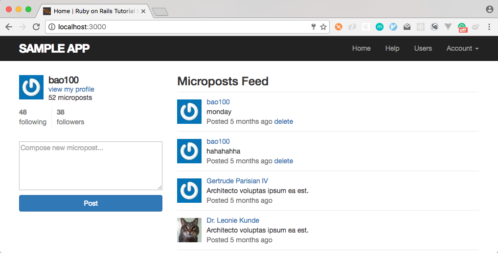
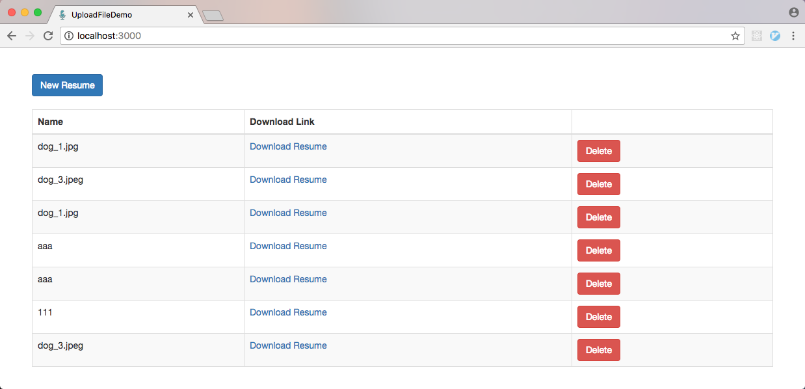

# Rails Study

Practice different rails samples follow different tutorials.

## Note

1. [*Ruby on Rails Tutorail* Book Note 1](./note/ruby-on-rails-tutorial-note.md)
1. [*Ruby on Rails Tutorail* Book Note 2](./note/ruby-on-rails-tutorial-note-2.md)
1. [Youdao Note](http://note.youdao.com/share/?id=7e42bb0ae8c4c7a3f04cb941552cb711#/)
1. [Upload File Note](./note/upload-file-note.md)

## Samples

### `simple_blog`

A simple and basic blog sample, follow ruby on rails [official getting started guide](http://guides.rubyonrails.org/getting_started.html).

### `my_api`

Practice api only app by rails 5 native api only mode.

- <https://wyeworks.com/blog/2015/6/11/how-to-build-a-rails-5-api-only-and-backbone-application>
- <http://sourcey.com/building-the-prefect-rails-5-api-only-app/>

### `microblog_api`

Another api only app.

- <https://ruby-china.org/topics/30573>
- <https://ruby-china.org/topics/25822>

### `rails_tutorial`

The samples follow the book [*Ruby on Rails Tutorial*](https://www.railstutorial.org/book).

1. `micropost_web`

   A twitter-like micro-post web site.

   

### `item_cart`

The sample about how to integrate react in rails by 'react-rails' gem.

- <http://tutorials.pluralsight.com/ruby-ruby-on-rails/building-a-crud-interface-with-react-and-ruby-on-rails>

### `upload_file_demo`

The sample about how to upload file by CarrierWave gem and jQuery File Upload plugin.

[Note](./note/upload-file-note.md)

