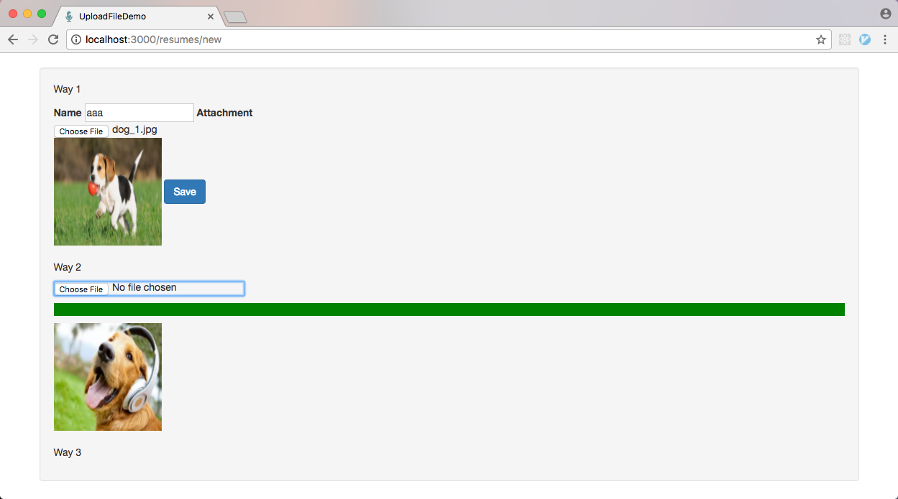

# Rails Study

Practice different rails samples follow different tutorials.

## Notes

* Ruby on Rails Tutorial
    * [Note 1 (1 - 4 章)](./notes/ruby-on-rails-tutorial/note-1.md)
    * [Note 2 (5 - 6 章)](./notes/ruby-on-rails-tutorial/note-2.md)
    * [Note 3 (7 - 8 章)](./notes/ruby-on-rails-tutorial/note-3.md)
    * [Note 4 (9 - 10 章)](./notes/ruby-on-rails-tutorial/note-4.md)
    * [Note 5 （11 - 14 章)](./notes/ruby-on-rails-tutorial/note-5.md)
* Agile Web Development Rails 5
    * [Note 1 (1 - 11)](./notes/agile-web-development-rails-5/note-1.md)
    * [Note 2 (12 - 22)](./notes/agile-web-development-rails-5/note-2.md)
    * [Note 3 (19 - 23)](./notes/agile-web-development-rails-5/note-3.md)
    * [Note 4 (21 - 24)](./notes/agile-web-development-rails-5/note-4.md)
* [Upload File Note](./notes/upload-file-note.md)

## Samples

### `simple_blog`

A simple and basic blog sample, follow ruby on rails [official getting started guide](http://guides.rubyonrails.org/getting_started.html).

### `my_api`

Practice API-Only app by rails 5 native API-Only mode.

- <https://wyeworks.com/blog/2015/6/11/how-to-build-a-rails-5-api-only-and-backbone-application>
- <http://sourcey.com/building-the-prefect-rails-5-api-only-app/>

### `microblog_api`

Another API-Only app.

- <https://ruby-china.org/topics/30573>
- <https://ruby-china.org/topics/25822>

### `rails_tutorial`

The samples follow the book [*Ruby on Rails Tutorial*](https://www.railstutorial.org/book).

1. `micropost_web`

   A twitter-like micro-post web site.

   

### `agile-rails-5`

The samples follow the book *Agile Web Development with Rails 5*

### `upload_file_demo`

The sample about how to upload file by CarrierWave gem and jQuery File Upload plugin.

### `item_cart`

The sample about how to integrate react in rails by 'react-rails' gem.

- <http://tutorials.pluralsight.com/ruby-ruby-on-rails/building-a-crud-interface-with-react-and-ruby-on-rails>
