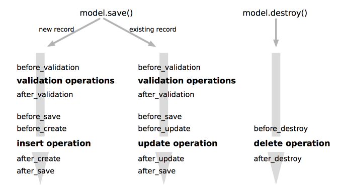

# Agile Web Development Rails 5 Note

## Part 1 - Getting Started

### 1. Installing Rails

#### macOS

方法1：先安装 brew，再用 brew install ruby，再用 gem 安装 rails

方法2：先安装 rbenv 或 rvm，再用 rbenv 或 rvm 安装 ruby，再用 gem 安装 rails

    $ gem install rails --version=5.0.0.1 --no-ri --no-rdoc

- 要掌握 rvm 或 rbenv 的使用
- 掌握 gem 的使用
- 掌握 bundler 的使用

#### 选择特定的 rails 版本

    $ gem list --local rails
    $ rails _5.0.0.1 --version

### 2. Instant Gratification

    $ bin/rails about
    // or
    $ bundle exec rails about

As you can see from the `bin/` prefix, this is running the rails command from the bin directory. This command is a wrapper, or *binstub*, for the Rails executable.

这里有讲到，在 development 下，修改的代码会立即生效，但是有额外的性能损失，因此在 production 下这个特性默认是关闭的。(原来如此，解答了我之前的一个疑惑，之前我在服务器上直接改代码后，代码并没有生效)

在 view 中显示动态内容的两种方法，以当前时间为例：

1. 在 view 中直接调用 `<%= Time.now %>`
2. 在 controller 中获得时间，赋值给实例变量，在 view 中显示此实例变量的值
       
       // controller
       @time = Time.now
       
       // view
       <%= @time %>

第二种方法的好处是更灵活一些，也是推荐的做法，但方法一也可以用于简单粗暴的实现。

#### Linking Page

尽量不要在 view 中 hardcode 一个链接，像这样：

    <a href="/say/hello">Hello</a>

而是使用 helper 为我们提供的 `link_to` 函数来动态生成链接：

    <%= link_to "Hello", say_hello_path %>
    
helper 函数一般用在 view 模板中，用来帮我们动态生成 html。比如 `link_to` 方法，我能想象它的简略实现：

    def link_to(content, link)
      "<a href=#{link}">#{content}</a>"
    end

`say_hello_path`，这是 rails 自动为路由生成的链接名，对应 'say/hello' 路由。

### 3. The Architecture of Rails Applications

#### MVC

> The *model* is responsible for maintaining the state of the application. Some- times this state is transient, lasting for just a couple of interactions with the user. Sometimes the state is permanent and is stored outside the application, often in a database.

> A *model* is more than data; it enforces all the business rules that apply to that data. For example, if a discount shouldn’t be applied to orders of less than $20, the model enforces the constraint. This makes sense; by putting the implementation of these business rules in the model, we make sure that nothing else in the application can make our data invalid. **The model acts as both a gatekeeper and a data store**.

model 不仅仅是数据，还包括对数据的一些处理，加工。

> The view is responsible for generating a user interface, normally based on data in the model. For example, an online store has a list of products to be displayed on a catalog screen. This list is accessible via the model, but it’s a view that formats the list for the end user. Although the view might present the user with various ways of inputting data, the view itself never handles incoming data. The view’s work is done once the data is displayed. There may well be many views that access the same model data, often for different purposes. The online store has a view that displays product information on a catalog page, and another set of views used by administrators to add and edit products.

view 负责输入 (??) 和输出，展示 model，面向终端用户。

> Controllers orchestrate the application. Controllers receive events from the outside world (normally, user input), interact with the model, and display an appropriate view to the user.

从上面这段描述来看，controller 还负责接受输入，而 view 而只负责展示??

(我可不可以这么理解，view 其实是算作输入源，它接受到输入后，并不作任何处理，而是交给 controller 来处理输入。view 接受输入，controller 处理输入)

其实对于 rails 的 MVC 来说，上面英文的描述其实也没错，因为在 rails 的 MVC 中，controller 是占主导，controller 的输入源来自 url，路由，跟 view 确实没有多少联系。controller 主要是接受这些路由输入，然后操作 model，然后输出到 view。

关于 view 上的按钮点击之类的啊，这类的交互是属于客户端的 mvc 范畴，而不是服务端。为什么 web 诞生的时候，html 没有 button 之类的，所有的可点击的都是 `<a>`，因为这时候还没有网页客户端的概念。这些 `<a>` 产生链接，点击后作为路由传递给服务器的 controller。

(我上次说 rails 的 MVC 其实更像 MVP，其实错了，MVP 里，M 和 V 是完全没有联系的，而 rails 的 MVC 里，你是可以在 view 的模板里访问 model 的)

> The controller supplies data to the view, and the controller receives events from the pages generated by the views.

#### Active Record

ORM

#### Action Pack: Then View and Controller

> When you think about it, the view and controller parts of MVC are pretty intimate. The controller supplies data to the view, and the controller receives events from the pages generated by the views. Because of these interactions, support for views and controllers in Rails is bundled into a single component, Action Pack.

View: ERB 模板

Controller: 中心，很多职责，响应路由，管理缓存，管理 helper 模块 (扩展 html 模板)，管理 session

### 4. Introduction to Ruby

Ruby is OO Language.

Ruby 的命名规范：

- 方法名，全小写字母，用 `_` 线分隔多个单词，成员变量用 `@` 加上小写字母；
- 类名，module 名，大写字母开头，双峰写法；
- symbol，符号，`:` 开头。

#### Data Types

- String: `''` 表示 raw string，连 `\n` 都不转义，`""` 会转义，而且支持插值
- Array & Hash
- 正则：/pattern/，str =~ /pattern/

#### Logic

control flow: if / while

blocks and iterators：

block 有 2 种形式，一种是用于单行的 `{}`，一种是用于多行的 `do...end`

在方法中用 yield 来调用传递进来的 block，并且可以在 yield 后面加上变量，从而给 block 传参。

    def wrap &b
        3.times(&b)
    end
    wrap { puts "Hi!" }

在参数中加上 `&` 表示命名的 block。

一个方法只能有一个 block，且这个 block 必须作为最后一个参数。

我觉得可以简单地把 block 理解成一种匿名回调函数。

block 经常和 iterator 一起使用。

Exception：

begin...rescue...end
raise

#### Organizing Structure

class 和 module

**class**

- 实例方法和类方法；
- 实例变量，访问器 (`attr_accessor` ...)

**module**

可以理解成一种带实现的接口，一种 minix。

module 有 2 个作用：

1. 作为 namespace ，防止命名冲突
1. 共享方法，module 里的所有 class 都可以共享此 module 中的所有方法，而不用继承自此 module；另外，class 也可以包含 module，然后使用 module 中的方法。一种 minix 的思想。而不是像 java 这种去实现一种接口的思想。方法注入? 方法扩展?

#### Ruby Idioms

1. empty! empty?
1. a||b, a||=b
1. lambda 操作符 ->，把 block 变成 Proc 的对象 (block, lambda, proc)

----

## Part 2 - Building an Application

### 5. The Depot Application

介绍了我们要练习的项目：一个简单版的购物网站。

初步的流程：

1. Use Cases：允许买者在这个网站上购物，允许卖者在这上面管理商品及订单
1. Page Flow：简单的用户交互流程
1. Data：需要哪些数据

### 6. Task A：Creating the Application

新建项目：

    $ rails new depot

使用 scaffold 快速生成所需文件，用 `generate scaffold` 同时生成 controller，model 和 view。

    $ bin/rails generate scaffold Product \
    title:string descrpition:text image_url:string price:decimal

执行 migration：

    $ bin/rails db:migrate

执行测试：

    $ bin/rails test

使用 `db/seeds.rb` 为数据库初始化一些数据，执行 `rails db:seed` 命令。

美化 products list page，涉及到的一些小技巧和 helper 方法：

1. 在 `application.html.erb` 中使用 `<body class='<%= controller.controller_name %>'>` 为不同的页面指定不同的根 class。
1. `class='<%= cycle(class_a, class_b) %>'`，在列表中交替使用不同的 class。
1. `image_tag`，`truncate`，`strip_tags`，`strip_tags` 从文本中剔除 html tag。

**鉴于对 rails 已经一些了解了，后面的内容不再仔细阅读，已经知道的跳过。**

### 7. TaskB：Validation and Unit Testing

Validate model by `validates` method:

    validates :title, :description, :image_url, presence: true 
    validates :price, numericality: {greater_than_or_equal_to: 0.01} 
    validates :title, uniqueness: true
    validates :image_url, allow_blank: true, format: {
      with: %r{\.(gif|jpg|png)\Z}i,
      message: 'must be a URL for GIF, JPG or PNG image.'
    }

给 product model 增加 validation 后，controller 的单元测试通不过了，修改 controller 的单元测试代码使之通过。

controller 的单元测试主要测试 controller 的各个 action，通过路由来触发，比如 `get products_url`，然后对 response 进行 assertion。比如：

    test "should get index" do 
      get products_url 
      assert_response :success
    end

然后我们编写 model 的单元测试，model 的单元测试测什么呢，主要还是测 model 增加的这些 validation，测试给各属性赋各种值的情况下，model 是否有效。比如，上面的 validations 规定了 title, description, image_url 不能为空，当它们为空时，model 将无效。

    test "product attributes must not be empty" do 
      product = Product.new
      assert product.invalid?
      assert product.errors[:title].any?
      assert product.errors[:description].any? 
      assert product.errors[:price].any? 
      assert product.errors[:image_url].any?
    end

另外，可以在 fixtures 里指定测试环境下数据库的初始值。

单独对 model 进行单元测试的命令：`bin/rails test:models`。

### 8. Task C：Catalog Display

这一章为买者实现了一个商品展示界面，以便他们购买。

增加了一个 StoreController，注意这个 contoller 不像 ProductsController 有直接关联的 model product，store controller 没有，很常见的 session controller 也没有直接关联的 model，静态页面比如 rails tutorial 一书中的 StaticPageController 也没有。所以不是每一个 controller 都有关联的 model。

添加路由 `root "store#index", as: store_index`，其中 `as: store_index` 表示生成的路由名字。

在 application.html.erb 中为所有页面添加了 banner 和 side layout。

为 store controller 添加更多测试用例，使用 `assert_select` 来比较返回的 html 中的内容是否与预期相符。`assert_select` 很强大，要掌握。

最后，学到了一点比较新的内容，就是在 view 模板中使用 `cache` 方法缓存 view 的片断 (view fragment)，提升性能。在 dev 环境要用 `rails dev:cache` 来开启或关闭。

    <% cache @products do %>
      <% @products.each do |product| %>
        <% cache product do %>
          

            <%= image_tag(product.image_url) %>
            <h3><%= product.title %></h3>
            <%= sanitize(product.description) %>
            

              <%= number_to_currency(product.price) %>
            

          

        <% end %>
      <% end %>
    <% end %>

### 9. Task D：Cart Creation

本章实现了简易的购物车。

创建 Cart model，表示购物车，将其 id 放到 session 里，表明此购物车只在当前浏览器中有效，关闭重启浏览器后之前购物车中的信息将丢失，实际上新创建了一个购物车。(人个觉得这个 Cart model 没有必要存在，因此里面只存了一个 id，而这个 id 其实可以直接使用 user.id，哦，我明白了，因为目前还没有账户系统，所以要创建出一个新的 cart 来，等有了账户系统后，这个 cart 就可以取消了，但也不排除后面会给它增加更多功能)。

将 cart 的操作作为 module 放在 concern 中，这样所有的 controller 就可以共享：

    module CurrentCart
      private
        def set_cart
          @cart = Cart.find(session[:cart_id])
        rescue ActiveRecord::RecordNotFound
          @cart = Cart.create
          session[:cart_id] = @cart.id
        end
    end

创建 LineItem model，并生成相应的 `line_items` 表，这其实是一个多对多的关联表，将 cart 和 product 关联起来。

如果某个 product 被加入到入购物车，则这个 product 不允许被删除，为 Product 添加 `before_destroy` callback，如果它的 `line_items` 不为空，则用 `throw :abort` 来中断删除操作：

    before_destroy :ensure_not_referenced_by_any_line_item

    private
      def ensure_not_referenced_by_any_line_item
        unless line_items.empty?
          errors.add(:base, 'Line Items present')
          throw :abort
        end
      end

添加 'Add to Cart' 的按钮，因为要使用 POST 请求，而 `<a>` 链接使用的是 GET 请求，因为我们要使用 `button_to` helper 方法，`button_to` 方法将生成 `<form>` 来使用 POST 请求。(如果不用 ajax，form 将是使用 POST 请求的唯一途径，form 同时也来用产生 PATCH/PUT/DELETE 请求，而 `<a>` 则用来产生 GET 请求。)

在测试中，使用 `follow_redirect!` 来得到重定向后的结果。

### 10. Task E：A Smarter Cart

优化购物车，将相同的产品条目合并，因此为 `line_items` 表增加 quantity 列。增加 quantity 后，需要将原来老的数据进行合并，将多条相同条目合并成一条，并修改 quantity 列的值，怎么来做的，以前我的做法是在 `libs/tasks/task.rb` 写一个 task 来做这个事情，从本节学习到，正确的做法应该是写一个实现 `up` 方法的 migration，同时实现一个 `down` 的方法实现逆操作以便进行回滚。

    class CombineItemsInCart < ActiveRecord::Migration[5.0]
      def up
        Cart.all.each do |cart|
          sums = cart.line_items.group(:product_id).sum(:quantity)

          sums.each do |product_id, quantity|
            if quantity > 1
              cart.line_items.where(product_id: product_id).delete_all

              item = cart.line_items.build(product_id: product_id)
              item.quantity = quantity
              item.save!
            end
          end
        end
      end

      def down
        LineItem.where('quantity > 1').each do |item|
          item.quantity.times do 
            LineItem.create(
              cart_id: item.cart_id,
              product_id: item.product_id,
              quantity: 1
            )
          end
          item.destroy
        end
      end
    end

使用 `rails db:migrate:status` 查看当前的 migration 状态。

使用 `rails db:rollback VERSION=xxxx` 进行 migration 的回滚操作，VERSION 指定的是要回滚的那个版本，注意，不是要回滚到的那个版本，就是单指那个版本就被回滚掉。如果不加 VERSION 参数，那么默认是指最近的版本。VERSION 的值可以通过上面的 `rails db:migrate:status` 命令获得。

详细的回滚：[How to rollback a specific migration?](https://stackoverflow.com/questions/3647685/how-to-rollback-a-specific-migration)

#### Handling Errors

这一节的内容对我来说比较有用。有很多新的知识点：

1. `rescue_from ActiveRecord::RecordNotFound, with: :invalid_cart`，在 controller 中用 `recue_from` 捕抓全局异常，这样就不用在每一个方法中单独处理了。
1. `logger.error 'Attempt to access invalid cart #{params[:id]}`，使用 `logger.error` 将错误输出到日志文件里持久保存，日志在 `log/` 目录下。
1. `redirect_to store_index_url, notice: 'Invalid cart'`，redirect 时带上的 notice 参数的值，将存储在 `flash[:notice]` 中，flash 的值存储在 session 中。因此可以跨请求使用。
1. `bin/rails log:clear LOGS=test`，清除 `log/test.log`。

查看了 `test.log` 中的内容后，我理解了我之前的一个疑问，fixture 中自动生成的 product 的两个记录是相同的，而我们在 Product model 中增加了 title 的 uniqueness validataion，那这两个 product 怎么还能插到数据库中呢，原来 fixture 中的数据并没有转换成 model 后再调用 model 的 create 方法来插入数据库，而是直接使用了数据库的 insert into 操作，这样就绕过了 model 的 validation，而在数据库层面，我们并没有为 schema 增加 title 必须唯一的限制。

#### Finishing the Cart

这一节实现清空购物车，实际并不是把 `cart.line_items.clear`，而是直接 `cart.destroy`。

在进行修改或删除数据库数据操作时，安全很重要，比如这里在进行 `cart.destroy` 时，一定要判断要删除的 `cart.id` 是否与 `session[:cart_id]` 相同，否则就把别人的 cart 删除了。

### 11. Task F：Adding a Dash of Ajax

#### Moving the Cart

把 cart 显示到每个页面的左侧栏，这样，cart 部分的内容就需要抽取出来进行复用。利用 view 的 partial 功能，将需要复用的内容抽取成 partial。

此例中，将 line item 的展示抽取成 `_line_item.html.erb` partial，然后在 cart 中直接用 `<%= render cart.line_items %>` 渲染，注意，因为 `line_items` 是可遍历的，因此 render 内部会自动循环渲染；将 cart 的展示抽取成 `_cart.html.erb` partial，然后在 cart 的 show 页面中直接使用 `<%= render @cart %>`；然后在 `applicaton.html.erb` 中 side 栏中就可以也用一行代码 `<%= render @cart %>` 来渲染 cart 了。

因为不是每个页面都可以拿到 @cart 的值，因为在 `application.html.erb` 中渲染 @cart 时，加一个条件判断，只有 @cart 有值时才渲染：

    <% if @cart %>
      <%= render @cart %>
    <% end %>

#### Creating an Ajax-Based Cart

这一小节实现了用 ajax 请求来实现页面的局部刷新，只更新页面 side 栏的 cart 部分内容。

这一小节对我来说觉得很有意思，我原以为一旦用了 ajax，那么就意味着返回的 response 内容就是 json。我以前分析过 github 页面上的请求，有些请求使用了 ajax 请求，返回值却不是 json，当时就觉得好奇。从这一节明白了，原来还可以返回一段 js 代码，然后让浏览器执行，cool！

三步：

1. 在 view 中为需要转成 ajax 的请求加上 `remote:true`：

        <%= button_to 'Add to Cart', line_items_path(product_id: product), remote: true %> 

1. 在 controller 中加上对 js 请求的响应操作：

        respond_to do |format|
          if @line_item.save
            format.html { redirect_to store_index_url }
            format.js
            format.json { render :show, status: :created, location: @line_item }

1. 编写对应的 js view，比如 `create.js.erb`：

        $('#cart').html("<%=j render(@cart) %>")

   j 表示 escape_javascript() 方法的简写，表示把后面 render 出来的 html 内容转换成 javascript 安全的内容。

为什么服务器知道这些请求是在请求 js 代码，而不是 json 呢，通过 chrome 的 devtool 分析这些请求得知，这些请求的 header 中的 accpet 的值是 javascript，而不是 json：

    Accept: */*;q=0.5, text/javascript, application/javascript, application/ecmascript, application/x-ecmascript

#### Highlighing Changes

高亮当前变化的 line item，使用 jquery 的 fade 动画效果，要使用到 jquery-ui 库，通过 `gem 'jquery-ui-rails'` 引入。

    $('#current_item').css({'background-color': '#88ff88'})
                      .animate({'background-color': '#114411'}, 1000);

#### Hiding Empty Cart

定义了一个 helper 方法来隐藏空的 cart，并在 view 中使用：

    # application_helper.rb
    module ApplicationHelper
      def hidden_div_if(condition, attributes = {}, &block)
        if condition
          attributes['style'] = 'display: none'
        end
        content_tag('div', attributes, &block)
      end
    end

    # application.html.erb
    <% if @cart %>
      <%= hidden_div_if(@cart.line_items.empty?, id: 'cart') do %>
        <%= render @cart %>
      <% end %>
    <% end %>

#### Broading Updates with Action Cable

使用 Action Cable，在客户端与服务端之间建立一个长链接 (在 chrome 上使用的是 websocket 技术)，在服务端更新数据后 (比如 product 的 price)，广播到某个 channel 上，客户端从这个 channel 上接收到数据后，用 javascript 更新界面。

步骤：

1. 生成 channel，使用 `rails g channel products` 命令
1. 修改 `product_channel.rb`，定义 `ProductsChannel` 从哪个 channel 订阅

        def subscribed
          stream_from "products"
        end

1. 服务端数据更新后，广播到 channel 上：

        # products_controller.rb
        def update
          respond_to do |format|
            if @product.update(product_params)
              format.html { redirect_to @product, notice: 'Product was successfully updated.' }
              format.json { render :show, status: :ok, location: @product }

              @products = Product.all
              ActionCable.server.broadcast 'products',
                html: render_to_string('store/index', layout: false)

1. 客户端从 channel 接收到新数据后，更新 html：

        // products.coffee
        App.products = App.cable.subscriptions.create "ProductsChannel",
          received: (data) ->
            # Called when there's incoming data on the websocket for this channel
            $(".store #main").html(data.html)

### 12. Task G：Check Out!

#### Capturing an Order

创建订单，将 cart 中的 line items 转移到 order 中，并将 cart 销毁。

涉及到的新的知识点，定义 order 的 `pay_type` 时，在数据库层面的类型是 integer，但在 model 层面，使用了 enum 类型来约束它的范围，并在 form 中使用 select 来显示 `pay_type` 的值。

`order.rb`：

    class Order < ApplicationRecord
      enum pay_type: {
        "Check"          => 0,
        "Credit card"    => 1,
        "Purchase order" => 2,
      }
      validates :name, :address, :email, presence: true
      validates :pay_type, inclusion: pay_types.keys
      ...

`orders/_form.html.erb`：

    

      <%= f.label :pay_type %>
      <%= f.select :pay_type, Order.pay_types.keys,
                  prompt: 'Select a payment method' %>
    

`button_to` 也可以生成 get 请求的 form，它会生成 `url?params` 的请求：

    <%= button_to "Checkout", new_order_path, method: :get %>

#### Atom Feeds

为 product 生成 `who_bought` 的 atom feed。

rails 居然原生支持 rss feed，有点惊讶。

`who_bought` 只作用在某个 product 上，所以路由的定义是这样的：

    resources :product do
      get :who_bought, on: :member
    end

`on: :member` 就表示 `who_bought` 只作用在某个 product 上，比如 `products/3/who_bought`，而不会作用在 product 集合上，比如 `products/who_bought`。

### 13. Task H：Sending Mail

#### Sending Confirmation Emails

当订单创建和出货时，给用户发送邮件，使用 rails 的 Action Mailer。

分三步走：

**1. Action Mailer 的配置**

配置 action mailer 的发送方式，有三种：`:smtp`，`:sendmail`，`:test`，第一种是默认，第二种是本机上的第三方邮件服务，比如 sendgrid，第三种用于测试，并不真正发送邮件。

    config.action_mailer.delivery_method = :smtp

如果 test/development/staging/production 使用一样的配置，那么可以将配置写到 config/environment.rb 中，否则，写到 config/environments 目录下对应环境的文件中，比如 config/environments/development.rb 中。

如果选择了 `:smtp` 或 `:sendmail` 方式，则还需要配置 `smtp_settings`，比如：

    config.action_mailer.smtp_settings = {
      address:              "smtp.gmail.com",
      port:                 587,
      domain:               "domain.of.sender.net",
      authentication:       "plain",
      user_name:            "dave",
      password:             "secret",
      enable_starttls_auto: true
    }

**2. 创建 Action Mailer Controller 和 View**

使用 `g scaffold mailer` 来生成和 mailer 相关的 controller 和 view：

    $ rails g scaffold mailer Order received shipped

实现 OrderMailer：

    class OrderMailer < ApplicationMailer
      default from: 'Sam Ruby <depot@example.com>'

      def received(order)
        @order = order
        mail to: order.email, subject: 'Pragmatic Store Order Confirmation'
      end

      def shipped(order)
        @order = order
        mail to: order.email, subject: 'Pragmatic Store Order Shipped'
      end
    end

这里面最关键的就是 mail 方法，参数有 `:to`，`:from`，`:subject`，`:cc`，`:bcc` 等。

每一个 action 方法都会去渲染和方法名字相同的 view，比如 received 方法会去找到 `received.html.erb` 或 `received.text.erb` 模板进行渲染，如果两者都存在，那么两个都渲染，这个是正常的 controller 的行为不太一样，所以我们一般只保留一种格式的模板，html 或 text，而把另一种删除。

同时修改 `mailers/preview/order_mailer_preview.rb`，以方便预览邮件内容。

修改相应的 view 模板。

**3. 发送邮件**

在订单生成的时候，调用 `OrderMailer.receiver(@order).deliver_later` 真正地向用户发送邮件。

    # orders_controller.rb
    if @order.save
      Cart.destroy(session[:cart_id])
      session[:cart_id] = nil
      OrderMailer.received(@order).deliver_later

(但这里我比较好奇的是，received 方法在定义的时候，并没有定义成类方法，而是实例方法，但这里调用的时候为什么是按类方法调用的呢? 这里有一个解释：<http://smsohan.com/blog/2011/01/28/actionmailer-3-why-do-you-call-instance/>)

#### Integration Testing of Applications

集成测试，测试一个用户购买一本书的整个流程。

rails 的集成测试，是测试每一个 use case。

貌似 rails 里的单元测试和 java 里的单元测试的概念不尽然相同啊，java 里的单元测试，指的是对一个类的一个方法进行测试，而在 rails 里，指的是对一个 model 的属性进行各种判断。而 rails 的 controller/mailer 的功能测试，对应到 java 里，其实也算是单元测试。

rails 的测试分类：

1. model 的单元测试，`test/models`
1. controller 的功能测试，`test/controllers`
1. mailer 的功能测试，`test/mailers`
1. 集成测试，`test/integration`

在此例中，因为邮件发延迟发送的，是放在一个待发送队列中，因此 rails 提供了 `perform_enqueued_jobs` 的 helper 方法来辅助。

### 14. Task I：Loggin In

用户登录系统，用户权限控制。

(总体感觉这一章的内容，在这本书上讲得会让你觉得很简单，不复杂，而在 ruby on rails tutorial 这本书上，把这部分内容复杂化了。)

(另外，ruby on rails tutorial 一书总体还是遵循了 TDD，先写驱动，再实现功能，而此书是先实现功能，再写测试。)

#### Adding Users

创建 User scaffold，包括 UsersController，User model 及相关的 view，实现 user 的注册。

在创建 scaffold 时，使用 `password:digest` 指定 password 为 digest 类型，这样，生成的 model，将会有 `password` 和 `password_confirmation` 两个虚拟属性 (在数据库中并不真实存在)，以及 `password_digest` 的真实属性 (在数据库中有真实的列)，两个虚拟属性是通过 model 中的 `has_secure_password` 方法实现的。

    class User < ApplicationRecord
      validates :name, presence: :true, uniqueness: :true
      has_secure_password
    end

#### Authenticate Users

创建 SessionsController 用于实现用户的登录，而且并没有对应的 session model，而是使用 user model。

登录后，将 user id 存在 `session[:user_id]` 中，登出时，将 `session[:usre_id]` 置为 nil。

在生成用户登录的 form 时，由于此时我们并没有一个相应的 session model，所以我们不能用 `form_for(model_obj)` 方法了，而是用 `form_tag` 来手动实现整个 form，相应的 `f.text_filed` 都要用对应的 `text_field_tag` 来替换。

    <%= form_tag do %>
      <fieldset>
        <legend>Please Login</legend>

        

          <%= label_tag :name, 'Name:' %>
          <%= text_field_tag :name, params[:name] %>
        

        

          <%= label_tag :password, 'Password:' %>
          <%= password_field_tag :password, params[:password] %>
        

        

          <%= submit_tag 'Login'%>
        

      </fieldset>
    <% end %>

路由的定义：

    controller :sessions do
      get     'login'  => :new
      post    'login'  => :create
      delete  'logout' => :destroy
    end

#### Limiting Access

使用 `before_action` 实现在每一个 action 之前检查用户是否登录，实现在基类 ApplicationController 中：

    class ApplicationController < ActionController::Base
      protect_from_forgery with: :exception
      before_action :authorize

      protected
        def authorize
          unless User.find_by(id: session[:user_id])
            redirect_to login_url, notice: 'Please login'
          end
        end
    end

然后在子类中，用 `skip_before_action :authorize` 为不需要检查权限的 action 跳过这个回调。

增加 `before_action :authorize` 的回调后，对我们的测试产生了很大的影响，我们用 `setup` 方法来实现在每个测试之前先进行用户登录：

    # test/test_helper.rb
    class ActionDispatch::IntegrationTest
      def login_as(user)
        post login_url, params: { name: user.name, password: 'secret' }
      end

      def logout
        delete logout_url
      end

      def setup
        login_as users(:one)
      end
    end

#### Adding a Sidebar，More Administration

在 User model 中使用 `after_destroy` callback 来禁止删除最后一个用户，当用户数为 0 时，在回调中抛出异常，然后在 UsersController 中使用 `rescue_from` 来捕捉并处理这个异常。

    class User < ApplicationRecord
      ...
      after_destroy :ensure_an_admin_remains

      class Error < StandardError
      end

      private
        def ensure_an_admin_remains
          if User.count.zero?
            raise Error.new "Can't delete last user"
          end
        end
    end

### 15. Task J：I18n

实现部分页面的国际化，即多语言支持，包括货币，model 的错误信息的翻译，语言的动态切换。

#### Selecting the Locale

i18n 的初始化放在 `config/initializers/i18n.rb` 中。

翻译文件都放在 `config/locales` 目录下，一般约定以 locale 命名文件，比如 `en.yml`，`es.yml`。`I18n.available_locales` 得到的就是 `config/locales` 目录下所有文件支持的语言。

实际上 `config/locales` 目录下的文件名是可以随便取的，文件里的内容决定了我们得到的 `I18n.availabel_locales` 的值，比如，我在 locales 目录下只放置一个叫 `anythings.yml` 的文件，里面的内容如下：

    en:
      hello: 'hello'

    es:
      hello: 'hi'

那么 `I18n.available_locales` 得到的值是 `[:en, :es]`。

修改路由，使 locale 成为 url 中的一部分，加上括号表示其可选：

    scope '(:locale)' do
      resources :orders
      resources :line_items
      resources :carts
      root 'store#index', as: 'store_index', via: :all
    end

`via: :all` 表示支持所有的 http 方法，比如 GET/POST/DELETE。(感觉 rails route 简直是最复杂的一部分，规则太多了)

经常在 `rails routes` 的输出中看到 `(.:format)`，这表示请求格式参数是可选的，我们可以在请求的 url 后面加上 `.html`，`.json`，`.xml` 这种格式参数，也可以不加。

在基类 ApplicationController 中为所有 action 加上回调 `before_action :set_i18n_locale_from_params`。

#### Translating the Storefront / Tranlating Checkout

为界面上需要翻译的地方进行翻译。

一些技术点：

1. `t('.home')`，以 `.` 为前缀的 key，表示省略了默认的前缀，默认的前缀为此文件所处的目录级别，比如此文件处理 `views/layouts/application.html.erb`，那么省略的前缀为 `layouts.application`。

1. `t('.title_html')`，以 `_html` 结尾的 key，表示会对其值自动做 `html_safe` 转换，这样的值里面一般包含了 html 转义字符。

1. 对货币单位的国际化，在相应语言下定义 `number.currency.format`，如下所示：

        es:

          number:
            currency:
              format:
                unit:      "$US"
                precision: 2
                separator: ","
                delimiter: "."
                format:    "%n&nbsp;%u"

1. 对 active model 的 validation 出错消息进行国际化，在相应语言下定义 `activerecord.errors.messages`。

1. 对 active model 的属性显示名称进行国际化，在相应语言下定义 `activerecord.models` 和 `activerecord.attributes.model`：

        activerecord:
          models:
            order:       "pedido"
          attributes:
            order:
              address:   "Direcci&oacute;n"
              name:      "Nombre"
              email:     "E-mail"
              pay_type:  "Forma de pago"

1. `raw` 方法在多语言字符串中使用插值：

        errors:
            header:
              other:     "%{count} errores han impedido que este %{model} se guarde"

        <h2><%= raw t('errors.template.header',
                      count: order.errors.count,
                      model: t('activerecord.models.order')) %></h2>

#### Add a Locale Switcher

实现了一个 Locale Switch，使用 `<select>` 控件。

这里使用了一个小技巧，来兼容两种情况：允许 JavaScript 和不允许 JavaScript 的情况。当不允许 JavaScript 的时候，会显示一个 submit 的按钮来提交表单，当允许 JavaScript 时，用 JavsScript 代码隐藏 submit 按钮，并且当 `<select>` 的值改变时，自动提交表单。虽然这种兼容性的处理在现代 web 开发中已经不需要了 (哪个网页能离得开 JavaScript 啊)，但这种思想还是很妙的，而且学习到了如何自动提交表单。

    <%= form_tag store_index_path, class: 'locale' do %>
      <%= select_tag 'set_locale',
          options_for_select(LANGUAGES, I18n.locale.to_s),
          onchange: 'this.form.submit()' %>
      <%= submit_tag 'submit' %>
      <%= javascript_tag "$('.locale input').hide()" %>
    <% end %>

`I18n.locale.to_s`，为什么 `I18n.locale` 要 `to_s` 呢，因为 `I18n.locale` 的值是符号，而不是字符串。将符号转换成字符串用 `to_s`，将字符串转换成符号呢，用 `to_sym`，比如：

    > "es".to_sym
    => :es

最后，发现一个奇怪的问题，当访问首页时，如果我切换过一次语言，比如把默认的 en 改成 es，之后再访问首页，不停地刷新，发现几次中就能刷出一次默认语言为 es 来，非常奇怪。我的猜测：rails 使用了线程池，当我在某一次把 `I18n.locale` 改成 es 后，这个线程的 `I18n.locale` 就固定为 es 了，当我之后不停地刷新后，总有一次能用回这个线程，然而由于访问首页时，并没有指定语言，因此根据实现的逻辑，是不会去修改这个 `I18n.locale` 值的，因此它的值还是原来的 es。

验证猜想的方法：

1. 重启服务器，访问首页，不要切换语言，不停刷新首页，预期结果是不会出现 es 的页面，结果也是如此。
1. 只要切换过一次语言，之后再刷新，总有机率能刷出 es 的页面。

解决办法，修改 `set_i18n_locale_from_params` 方法的逻辑。

原来的逻辑：

    def set_i18n_locale_from_params
      if params[:locale]
        if I18n.available_locales.map(&:to_s).include?(params[:locale])
          I18n.locale = params[:locale]
        else
          flash.now[:notice] = "#{params[:locale]} translation not available"
          logger.error flash.now[:notice]
        end
      end
    end

修改后的逻辑：

    def set_i18n_locale_from_params
      if params[:locale]
        if I18n.available_locales.map(&:to_s).include?(params[:locale])
          I18n.locale = params[:locale]
        else
          I18n.locale = I18n.default_locale
          flash.now[:notice] = "#{params[:locale]} translation not available"
          logger.error flash.now[:notice]
        end
      else
        I18n.locale = I18n.default_locale
      end
    end

测试后发现问题已经不存在了。

### 16. Task K：Deployment and Production

这一章讲的是如何将 rails app 布署到 production 服务器。

没有很仔细地看，简单地了解了整个过程，需要使用 Apache, MySQL，Passenger，Capistrano。不过我们的项目一般用的是 Ngnix 和 PostgreSQL。

capistrano 会在工程目录下生成 `Capfile`，`config/deploy.rb`，`config/deploy/[environment].rb` 等文件。

布署 production 的命令：`cap production deploy`，回滚：`cap production deploy:rollback`。

### 17. Depot Retrospective

复盘整个 depot 项目，都做了哪些工作。

- Model
- View
- Controller
- Configuration
- Testing
- Deployment

`rails stats` 命令查看代码统计。
 
## Part 3 - Rails in Depth

### 18. Finding Your Way Around Rails

工程目录下的各个文件和目录的作用。

lib 目录下存放独立于 controller/view/model 逻辑的代码，比如类似生成 pdf 的逻辑，解析 rss 的逻辑。当 rails 启动时 lib 目录里的文件已经不会再处动加载了，需要把 lib 目录加到 rails 的自动加载目录配置中。

    # config/application.rb
    config.autoload_paths += %W(#{Rails.root}/lib)

如果不将 lib 目录配置到自动加载目录中，你也可以在需要这些文件的地方手动 require 所需文件，比如用 `require "shipping/airmail"` 来加载 `lib/shipping/airmail.rb` 文件。

(controllers/concern 用来存放 controller 共用的逻辑，models/concern 用来存放 models 共用的逻辑，app/helpers 目录用来存放 view 的辅助方法)。

lib/tasks 目录下存放用 rake 来执行的 `.rake` 文件，不属于 `rails server` 启动后的服务的一部分，可以单独在命令行执行，一般用于执行 migration 任何，文件以 `.rake` 结尾。

    # lib/tasks/db_schema_migrations.rake
    namespace :db do
      desc "Prints the migrated versions"
      task :schema_migrations => :environment do
        puts ActiveRecord::Base.connection.select_values(
        'select version from schema_migrations order by version' )
      end
    end

可以用 rails 或 rake 命令来执行这个 task：

    $ [RAILS_ENV=test/staging/production] bin/rails db:schema_migrations
    $ [RAILS_ENV=test/staging/production] bin/rake db:schema_migrations

bin 目录存放可执行的脚本或命令，一般是 wrapper。

bin/rails 脚本可执行的操作：

    $ bin/rails console/dbconsle/destroy/generate/new/runner/server

config 目录存放各种配置，包括路由 (routes.rb)，数据库 (database.yml)，initializer (`initializers/*.rb`)，locale (`locales/*.yml`)，deployment (`deploy/*.rb`，deploy.rb) 等。

在 server 启动之前，会最先加载 `config/environment.rb` 和 `config/application.rb`，其次是 `config/environments` 目录下各环境对应的配置。

启动 server 时指定环境，除了可以用 `RAILS_ENV` 来指定，还可以用 `-e` 来指定：

    $ rails server -e production

**Naming Conventions**

其它略。

controller 需要分组时，在 controllers 目录下建立子目录，比如 `controllers/admin` 目录，在 admin 目录中的 controller 都将置于 `Admin` module 下。同时，相应的 view 也将置于 `views/admin` 目录下。

### 19. Active Record

#### Defining Your Data

在 `initializers/inflections.rb` 中可以修改一些默认的命名约定，比如单复数转换：

    ActiveSupport::Inflector.inflections do |inflect| 
      inflect.irregular 'tax', 'taxes'
    end

在 model 使用 `self.table_name` 来重新指定对应的表名：

    class Sheep < ApplicationRecord 
      self.table_name = "sheep"
    end

model 的其它一些方法：

    > Order.column_names
    > Order.columns_hash["pay_type"]

db 和 model 的数据类型有一个转换关系，比如 sql 中的 int 类型对应 ruby 的 Fixnum 类型，查看 db 中列的原始数据，即未转型前的数据：

    > Product.first.created_at_before_type_cast
    => "2017-04-29 07:32:13.849007"
    > Product.first.created_at
    => Sat, 29 Apr 2017 07:32:13 UTC +00:00

#### Locating and Traversing Records

model 通过 `self.primary_key`，要以替换默认的 id 列，指定其它列作为 `primary_key` 列，这样之后，在给 `model.id` 赋值时，实际是赋值给新的 `primary_key` 列。

    class LegacyBook < ApplicationRecord 
      self.primary_key = "isbn"
    end

    book = LegacyBook.new
    book.id = "0-12345-6789"
    book.title = "My Great American Novel"
    book.save
    # ...
    book = LegacyBook.find("0-12345-6789")
    puts book.title   # => "My Great American Novel" 
    p book.attributes # => {"isbn" =>"0-12345-6789",
                      #     "title"=>"My Great American Novel"}

`model.attributes` 等同于 `model.as_json`，输出 model 的 hash。

表的三种关联关系：一对一，一对多，多对多。

一对一：拥有外键的表，具有 `belongs_to` 声明，另一方则有 `has_one` 声明。

一对多：拥有外键的表，具有 `belongs_to` 声明，另一方则有 `has_many` 声明。

多对多：需要借助关联表，比如 product 有多个 category，而 category 也属于多个 product，那么关联表 `categories_products` 里的列为 `product_id`、`category_id`。product 和 category model 相互用 `has_and_belongs_to_many` 来声明对方。

    class Category < ActiveRecord::Base
      has_and_belongs_to_many :products
      # ...
    end

    class Product < ActiveRecord::Base
      has_and_belongs_to_many :categories
      # ... 
    end

哦，终于明白了原来 `has_and_belongs_to_many` 是用来干这个的，我以前的做法是通过 `has_many through` 来声明的，如下所示：

    class Category < ActiveRecord::Base
      has_many :categories_products # 这一行可有可无吧
      has_many :products, through: :categories_products
    end

通过后者这种方式来声明，关联表的表名是随便的，而前者的方式，由表名是固定的，由两个表按照字母排序通过下划线拼接在一起。然而我有一个疑问，像 `categories_products` 这样的表名，对应的 model 应该怎么命名，是 `CategoriesProduct` 还是 `CategoryProduct`，亦或是其它呢？

#### Creating, Reading, Updating and Deleting (CRUD)

**Creating**

使用 `new` 方法，然后 `save`，或者直接用 `create(hash)` 方法一步到位。

`new` 和 `create` 方法的参数支持 hash，`create` 方法还支持 hash 数组作为参数。

`new` 方法支持 block：

    Order.new do |o|
      o.name = "Dave Thomas" 
      #...
      o.save
    end

save， save!，create，create!

- save，成功返回 true，失败返回 nil
- save!，成功返回 true，失败抛出异常 RecordInvalid
- create，成功或失败都返回 model object，通过判断这个对象的 errors 来判断是否成功失败 (?? really)
- create!，成功返回 model object，失败抛出异常

**Reading**

无疑，这部分是重头戏。不过看下来后发现其实讲到的内容都已经用过了。

`find()`，参数是 `primary_key` 的值，而并不一定是 `id` 的值。如果记录不存在，这个方法会抛出 `ActiveRecord::RecordNotFound` 异常。

`find_by(hash)`，可以通过任意列及其值查找，如果记录不存在，返回 nil，不会抛出异常。

常见 sql 查询方法：where，order，limit，offset，select，joins，group ...

一些聚合统计方法：

    average = Order.average(:amount) # average amount of orders 
    max     = Order.maximum(:amount)
    min     = Order.minimum(:amount)
    total   = Order.sum(:amount)
    number  = Order.count

Scope：

      class Order < ApplicationRecord
        scope :last_n_days, ->(days) { where('updated < ?' , days) }
        scope :checks, -> { where(pay_type: :check) }
      end

      orders = Order.checks.last_n_days(7)

scope 之间可以链式调用。

`find_by_sql()`，通过原始的 sql 语句来查询。

find 系列方法，如果记录存在，则只返回结果中的第一条记录，即返回值是一个 model 对象，而不是 model 数组。

**Updating**

和 Creating 一条记录类似，Updating 也有两种方式，一种是在内存中修改后，调用 `save()` 保存，一种是直接用 `udpate(hash)` 一步到位，直接修改数据库。

`update_all(sql)`，修改所有符合条件的记录。

    result = Product.update_all("price = 1.1*price", "title like '%Java%'")

**Deleting**

1. `delete`，`delete_all`
1. `destroy`，`destroy_all`

第一种方法在数据库层面直接进行删除，第二种方法在 ActiveRecord 层面进行操作，会调用 model 的各种 callbacks。

使用示例：

    Order.delete(123)
    Order.first.delete
    User.delete([2,3,4,5])
    Product.delete_all(["price > ?", @expensive_price])

    order = Order.find_by(name: "Dave")
    order.destroy
    Order.destroy_all(["shipped_at < ?", 30.days.ago])

#### Participating in the Monitoring Process

Active Model 的生命周期的各种回调。

一图胜千言：

除了图中的回调外，还有比如 `after_find`，`after_initialize`。

`after_find` 在任何 `find` 操作后被调用。`after_initialize` 在 model create 后被调用。(那么和 `after_create` 的区别是什么？)

`before_validation` 和 `after_validation` 接受 `on: :create` 和 `on: :update` 参数。

定义 callback handler 的两种基本方式 -- 方法或 block：

    class Order < ApplicationRecord
      before_validation :normalize_credit_card_number 
      after_create do |order|
        logger.info "Order #{order.id} created"
      end

      protected
      def normalize_credit_card_number
        self.cc_number.gsub!(/[-\s]/, '')
      end
    end

可以为相同的 callback，比如 `before_create`，定义多个 handler，这些 handler 会按顺序依次执行，如果中间有某个 handler 返回了 false，那么调用就会被提前中断。

**Grouping Related Callbacks Together**

如果要定义一组相关的 callback，可以把它们定义在一个独立的 handler class 中，并且放在 `app/models` 目录下，这个 handler class 可以供多个 model 使用。在 handler class 中定义的方法名是固定的，和回调方法名一一对应，并且接受 model 作为参数，比如 `before_validation(model)`，`before_create(model)`。

示例：

    class CreditCardCallbacks
      # Normalize the credit card number
      def before_validation(model)
        model.cc_number.gsub!(/[-\s]/, '')
      end
    end

    class Order < ApplicationRecord
      credit_card_callbacks = CreditCardCallbacks.new
      before_validation credit_card_callbacks
      # ...
    end
    class Subscription < ApplicationRecord 
      credit_card_callbacks = CreditCardCallbacks.new
      before_validation credit_card_callbacks
      # ...
    end

上面的做法假设了 model 中都含 `cc_number` 这个属性，那如果有些 model 的这个作用的属性不叫 `cc_number` 这个名字呢，该怎么办，上面的做法耦合性太强了。我们可以换一种做法来降低这种依赖性，增强灵活性，我们在 Callback 的构造函数中把所需的属性名传进去，让这个属性名是可变的。

比如这样一个用来对 model 的多个属性进行加密和解密的 Callback Handler Class：

    class Encrypter
      # We're passed a list of attributes that should
      # be stored encrypted in the database
      def initialize(attrs_to_manage)
        @attrs_to_manage = attrs_to_manage
      end

      # Before saving or updating, encrypt the fields using the NSA and
      # DHS approved Shift Cipher
      def before_save(model)
        @attrs_to_manage.each do |field|
          model[field].tr!("a-z", "b-za")
        end
      end

      # After saving, decrypt them back
      def after_save(model)
        @attrs_to_manage.each do |field|
          model[field].tr!("b-za", "a-z")
        end
      end

      # Do the same after finding an existing record
      alias_method :after_find, :after_save
    end

使用：

    require "encrypter"
    class Order < ApplicationRecord
      encrypter = Encrypter.new([:name, :email])
      before_save encrypter
      after_save encrypter
      after_find encrypter

      protected
        def after_find
        end
    end

为什么要定义一个空的 `after_find` 方法，这是因为出于性能考虑，如果没有显式地定义一个 `after_find()` 方法，ActiveRecord 并不会去调用一个 `after_find` 回调，即使你指定了一个 `after_find` 回调。我想是因为 `find` 查询实在是太频繁了，所以 rails 不想让你轻易地使用 `after_find` 回调，因此增大了使用它的成本。

进一步优化，从上例可以看出，每一个想使用 Encrypter 的 model 都要重复上面七行代码，not cool！我们把这些逻辑放到基类的一个方法里，可以有多种方法，我们选择为 `ActiveRecord::Base` 扩展一个叫 `encrypt` 的方法：

    class ActiveRecord::Base
      def self.encrypt(*attr_names)
        encrypter = Encrypter.new(attr_names)
        
        before_save encrypter
        after_save  encrypter
        after_find  encrypter

        define_method(:after_find) { }
      end
    end

从上例中可以看出，ruby 有多么灵活，它可以在方法中动态地定义出一个方法来 (JavaScript 也可以)。

使用：

    class Order < ActiveRecord::Base
      encrypt(:name, :email)
    end

处理 model 的重复代码，还有一种选择是放到 concern 中，但这本书没有展开讲，只是提及了一下，参考阅读：[Put chubby models on a diet with concerns](https://signalvnoise.com/posts/3372-put-chubby-models-on-a-diet-with-concerns)。

**Transactions**

数据库的事物操作，将对数据库的一系列操作集合到一起，如果中途失败了，这些所有操作都将回滚，使之具有一种原子性。

一个例子：

    peter = Account.create(balance: 100, number: "12345")
    paul  = Account.create(balance: 200, number: "54321")

    Account.transaction do
      paul.deposit(350)
      peter.withdraw(350)
    end

由于 peter 没有足够的余额，导致 `peter.withdraw` 将失败 (`withdraw()` 方法内部失败将抛出异常)，从而导致 `paul.deposite()` 的操作也回滚。

但是要注意的是，虽然数据库的操作失败了，但 model 对象的值变化后并没有跟着回滚，因此此时，model 的值和数据库已不再同步。这是正常的，完全可以理解。

另外，当你使用 model 的 callback 时，比如 `dependent: :destroy`，`before_destroy: xxx`，rails 在内部就使用了 transaction，如果 callback 失败，将会引起一系列操作都回滚，比起你手动处理这些关联操作，这就是使用 callback 的好处，记住，优先使用 callback，但如果 callback 太影响性能，那就考虑手动处理，或直接操作数据库。(遇到的一个比较典型的例子就是，`destroy_all` 在操作大量数据时，因为同时会去删除和它有 `dependent: :destroy` 的记录，非常耗时，这时就要考虑用 `delete_all` 方法来替代，因为 `delete_all` 会跳过 ActiveRecord 层面，不关心任何回调，直接操作数据库。)

### 20. Action Dispatch and Action Controller

Action Pack 是 rails 的核心，它包括三部分：ActionDispatch，ActionController，ActionView。

- ActionDispatch：主要负责路由，接收请求，然后调用相应的 controller 的 action 方法。
- ActionController：处理请求，输出响应。
- ActionView：渲染响应。

不像 ActiveRecord 是独立存在的模块且可以用于非 web 的 Ruby 程序，以上三部分是紧密关联的，无法单独使用。

#### Dispatching Requests to Controllers

介绍了一些路由的写法，但并没有覆盖很全面，可以说只涉及了 routes 的极少部分。

resources：

    resources :products

默认 resources 产生 7 种 action (index，new，create，show，edit，update，destroy)，可以限制只产生部分或排除部分 action：

    resources :comments, except: [:update, :destroy]
    resources :comments, only: [:new, :create]

在 resources 上添加额外的 action：

    resources :proudcts do
      get :who_bought, on: :member
    end

`on: :member` 表示 `who_bought` 只作用在单个 product 上，如果要作用在 products 集合上，使用 `on: :collection`。

嵌套的 resources：

    resources :products do
      resources :reviews
    end

Routing Concerns，如果 product 和 user 都有 review，为了避免写相同的代码，可以使用 concern：

    concern :reviewable do
      resources :reviews
    end

    resources :products, concern: :reviewable
    resources :users, concern: :reviewable

Shallow Route Nesting：

    resources :products, shallow: true do 
      resources :reviews
    end

    /products/1         => product_path(1)
    /products/1/reviews => product_reviews_index_path(1)
    /reviews/2          => reviews_path(2)

响应不同数据格式的请求，`respond_to`：

    def show
      respond_to do |format|
        format.html
        format.json { render json: @product.to_json }
      end
    end

请求非 html 的 2 种形式：

    GET /products/123.json
    GET /products/123?format=json

#### Processing of Requests

请求的处理流程：当请求到达时，ActionDispatch 通过路由表找到对应的 controller action 方法，如果这个 action 方法未定义，则找 controller 中的 `method_missing()` 方法，如果没有方法被调用，ActionPack 就去找和 action 同名的 view 模板，如果找到了，就渲染此模板并返回给客户端，否则抛出 `AbstractController::ActionNotFound` 异常。

**Controller Environment**

在 action 方法被调用之前，controller 负责为 action 创建各种环境，主要是访问 request 的各种方法：

- `action_name`
- cookies
- headers：注意，不要在 headers 里操作 cookie，操作 cookie 用上面的 cookies 方法
- params
- request：表示请求对象
  - `request_method`：:delete，:get，:head，:post，:put 等
  - method：基本和 `request_method` 一样，但不包括 :head，:head 在这里将返回 :get
  - delete?，get?，head?，post?
  - `xml_http_request?`，`xhr?`：两者等于，用于判断是否是 ajax 请求
  - url：返回 URL 完整值
  - protocol，host，port，path，query_string
  - domain
  - `host_with_port`
  - `post_string`
  - ssl?
  - `remote_ip`
  - env：`request.env['HTTP_ACCEPT_LANGUAGE']`，获取浏览器定义的一些环境变量值
  - accepts：header 中 Accept 属性中指定的 Mime::Type 数组
  - format：根据 Accept header 计算出来的值，类似 Mime::HTML，Mime::JSON ??
  - `content_type`
  - headers：怎么又有一个 headers，是不是和上面的 headers 是相同值 ??
  - body
  - `content_length`

实际上这些功能都是由一个叫 Rack 的 gem 来实现的。

- response
- session

Action Pack 还有一个贯穿整体的功能模块，前面也讲到过了，就是 logger。

**Responding to the User**

响应的三种方式：

1. 渲染 `render()`
1. 跳转 `redirect_to()`
1. 返回文件 `send_xxx()`

如果在 action 中上面三种方法都没有调用，controller 会自动 render 和 action 同名的 view template。

**Rendering Templates**

说明 `render()` 的 n 种用法，这里列举了多达 11 种用法，感觉大部分都不常用。这里面有一种需要特别注意，`render(action: action_name)`，比如 `render(action: :edit)`，这个方法调用后，并不会去执行 `edit` action，只会去渲染 `edit` action 对应的 view 模板。

另外，从常识来说，一般以为，在 action 方法中调用了 `render()` 方法后，整个流程应该就中止了，后面的语句应该不再执行了，但在 rails 中并不是这样的，如果 `render()` 后面还有语句，而且 `render()` 后并没有 `return`，那么后面的语句就还会继续执行，如果后面还有 `render()` 方法，那么就会在一次 action 中执行多次 render，controller 会抛出异常。如下例所示：

    # DO NOT DO THIS
    def update
      @user = User.find(params[:id])
      if @user.update(user_params)
        render action: :show
      end
      render template: "fix_user_errors"
    end

`render()` 方法还接受三个选项：`:status`，`:layout`，`:content_type`。

`:layout` 用来设置渲染 view 模板时是否包括 `/layouts/application.html.erb` 的内容。(我自己这么理解的)

`:content_type` 用来设置 response header 的 `Content-Type` 值。

`render_to_string()` 方法，用法和 `render()` 差不多，但它的结果不会放到 response 中，不会返回给浏览器，可以在开发阶段用来调试，方便查看渲染结果。而且它在一次 action 中多次调用并不会引发异常。

**Sending Files and Other Data**

1. `send_data(data, options...)`
1. `send_file(path, options...)`

**Redirects**

1. `redirect_to(action, options)`
1. `redirect_to(path)`
1. `redirect_to(:back)`：跳转回 header 中 `HTTP_REFERER` 值指定的 url。

#### Objects and Operations That Span Requests

- session
- flash
- callback

**Rails Sessions**

session 用来保持状态，不要和 cookie 混淆，它们只是有一点点交集而已。

**Session Storage**

Session 的存储方式 `session_store`，在 rails 中多达 6 种：

- `:cookie_store`
- `:active_record_store`
- `:drb_store`
- `:mem_cache_store`
- `:memory_store`
- `:file_store`

这 6 种方式，除了第一种 `:cookie_store` 是存储在客户端，其余都是在服务端进行状态的持久化。而第一种也是最常用的方式，这就是为什么我们很容易把它和 cookie 混淆。cookie 是实现 session 的一种手段。

我认为，人们常说的 cookie 有广义和狭义之分，广义的 cookie，就是被浏览器客户端持久化的这些对象，会在每次请求时被浏览器自动携带，它包括狭义的 cookie 和 session。狭义的 cookie 就是所有的 cookie 中除去 session 的那部分。

如果采用 `:cookie_store` 方式的 session，数据失效很好处理，关闭浏览器，再打开浏览器，cookie 中的 session 部分就会被自动清空，所以这种方式 session 的有效周期维持在一个浏览器进程时长。这种方式将减轻服务端逻辑。

如果采用服务端方式的 session，session 的生命周期是永久的，因此必须借助过期时间来清除过期的 session。另外，要注意，采用服务端方式的 session，并不是说就不需要往客户端存储任何数据了，还是需要的，只是只需要存储一个 `session_id`，然后通过 `session_id` 到服务端再去拿对应的其它数据。

**Flash - Communicating Between Actions**

flash 用来在相邻两个 action 之前传递数据，因为只有 `redirect_to()` 可以实现 action 的跳转，因此 flash 主要就是和 `redirect_to()` 配套使用。

flash 是基于 session 来实现的，但它的生命周期比一般的 session 又短了很多，可以说是极短的，只能维持一个 action 的时长，在一个 action 中赋值，在下一个 action 中作用并失效。 (?? 内部到底是怎么实现的呢)

如果想让 flash 在当前 action 生效，那么使用 `flash.now()`，`flash.now()` 将更新 flash 的值但不会把它加到 session 里。

**Callbacks**

action 的 callback，有三类：

- before callback：`before_action`
- after callback：`after_ation`
- around callback：`around_action`

它们都接受 `:only` 和 `:except` 参数，callback 默认作用在所有 action 上，使用这两个参数可以使其仅作用或不作用在某些 action 上。

其它辅助方法：`skip_before_action` 和 `skip_after_acion`，在继承中，子类用这些方法来跳过在父类中定义的一些 callback。

`before_action` 和 `after_action` 都很好理解，分别作用在 action 之前和之后。因为它们定义的回调都可以是多个，因此，这个 callback 将按照队列依次调用。

在 `before_action` 回调中，如果有一个 callback 返回 false，或者调用了 `render()` 或 `redirect_to()`，整个流程就会被中断。

`after_action` 一般用来修改 response，或者压缩 response。

`around_action` 就很有趣了，很类似 koa 的机制，一种 middleware 的思想。是 `before_action` 和 `after_action` 的综合。它先执行一部分代码，当它遇到 `yield` 时，就会去执行相应的 aciton，当执行完 action 后，再去执行 `yield` 后面的代码。所以 `yield` 之前的代码相当于 `before_action`，`yield` 之后的代码相当于 `after_action`。如果这个 `around_action` 没有执行 `yield`，那么相应的 action 就不会执行，这相当于 `before_action` 返回了 false。

### 21. Action View

#### Using Template

在模板中可以访问到环境：

- controller 对象中所有的实例变量
- controller 对象中的 flash、headers、logger、params、request、response 和 session，但除了 flash，其它不推荐直接在模板中访问，其余方法在模板中直接访问的一个场景是用于在调试模式下输出当前值：

        <h4>Session</h4> <%= debug(session) %>
        <h4>Params</h4> <%= debug(params) %>
        <h4>Response</h4> <%= debug(response) %>

- 在模板中使用 `controller` 可以直接访问到当前 controller，`controller.controller_name` 可以得到当前 controller 的类名
- `base_path` 得到当得模板所在路径

模板的种类：

- `.builder`：产生 xml 格式的 response
- `.coffee`：javascript 模板
- `.erb`：一般用于产生 html 格式的 response，完整的格式是 `html.erb`
- `.scss`：css

其实还有挺多的啊，比如 `.jbuilder`，而且这些后缀都可以组合使用的，然后这些后缀从后往前，会依次调用相应的解析器。

#### Generating Forms

form 的各种输助方法：

- `form_for(model)`
- `text_field`，`text_area`，`search_field`，`telephone_field`，`url_field`，`email_field`，`number_field`，`range_field`，`email_field`
- `select`，`date_select`，`time_select`
- `hidden_field`，`password_field`
- `file_field`

#### Uploading Files to Rails Applications

通过 form 和 `file_field` 上传图片文件。在服务端直接把图片二进制存储在数据库表中，用 data 列存储二进制数据，name 列存储文件名，`content_type` 存储文件类型。

这其中用到的一些知识点：

**验证文件格式**

    validates_format_of :content_type,
                        with: /^image/,
                        message: "must be a picture"

**定义虚拟列**

在 view 模板中，定义了文件列为 `uploaded_picture`，`<%= form.file_field("uploaded_picture") %>`，但实际数据库中并不存在这一列，因此它是虚拟的，我们可以在 `picture.rb` 手动定义这样一个方法：

    def uploaded_picture=(picture_field)
      self.name = base_part_of(picture_field.original_filename)
      self.content_type = picture_field.content_type.chomp
      self.data = picture_field.read
    end

这样，存储的时候就很简单了：

    @picture = Picture.new(picture_params)
    @picture.save

**在 view 中显示上传的图片**

    <h3><%= @picture.comment %></h3>
     'picture', :id => @picture.id) %>"/>

    def picture
      @picture = Picture.find(params[:id])
      send_data(@picture.data,
                filename: @picture.name,
                type: @picture.content_type,
                disposition: "inline")
    end

#### Using Helpers

自己定义 helper 方法，使用内置的丰富的 helper 方法。

如果要在 view 模板中使用一些复杂的逻辑，尽量把这些逻辑抽取到 helper 方法中。

**用于格式化的内置 helper 方法**

    <%= distance_of_time_in_words(Time.now, Time.local(2016, 12, 25)) %>
    4 months
    <%= distance_of_time_in_words(Time.now, Time.now + 33, include_seconds: false) %>
    1 minute
    <%= distance_of_time_in_words(Time.now, Time.now + 33, include_seconds: true) %>
    Half a minute
    <%= time_ago_in_words(Time.local(2012, 12, 25)) %>
    7 months
    <%= number_to_currency(123.45) %>
    $123.45
    <%= number_to_currency(234.56, unit: "CAN$", precision: 0) %>
    CAN$235
    <%= number_to_human_size(123_456) %>
    120.6 KB
    <%= number_to_percentage(66.66666) %>
    66.667%
    <%= number_to_percentage(66.66666, precision: 1) %>
    66.7%
    <%= number_to_phone(2125551212) %>
    212-555-1212
    <%= number_to_phone(2125551212, area_code: true, delimiter: " ") %>
    (212) 555 1212
    <%= number_with_delimiter(12345678) %>
    12,345,678
    <%= number_with_delimiter(12345678, delimiter: "_") %>
    12_345_678
    <%= number_with_precision(50.0/3, precision: 2) %>
    16.67

`debug()` 方法用于 dump 当前变量的值，输出格式为 yaml：

    <%= debug(params) %>

    --- !ruby/hash:HashWithIndifferentAccess name: Dave
    language: Ruby
    action: objects
    controller: test

截断高亮文本：

    <%= simple_format(@trees) %>
    Formats a string, honoring line and paragraph breaks. You could give it the plain text of the Joyce Kilmer poem Trees, and it would add the HTML to format it as follows.
    
 I think that I shall never see  A poem lovely as a tree.
 
A tree whose hungry mouth is prest  Against the sweet earth’s flowing breast; 

    <%= excerpt(@trees, "lovely", 8) %>
    ...A poem lovely as a tre...

    <%= highlight(@trees, "tree") %>
    I think that I shall never see A poem lovely as a <strong class="high- light">tree</strong>. A <strong class="highlight">tree</strong> whose hungry mouth is prest Against the sweet earth’s flowing breast;

    <%= truncate(@trees, length: 20) %>
    I think that I sh...

处理单复数：

    <%= pluralize(1, "person") %> but <%= pluralize(2, "person") %>
    1 person but 2 people

**生成链接的 helper 方法**

- `link_to`，`button_to`，`link_to_unless_current`，`image_tag`，`mail_to`，
- `stylesheet_link_tag`，`javascript_include_tag`
- `auto_discovery_link_tag` (产生 rss 链接)

配置 asset 的根路径 (默认为当前域名)：

    config.action_controller.asset_host = "http://media.my.url/assets"

(哎！一想到这么多丰富的 helper 方法，如果使用前后端分离的构造，这些方法都不能在 javascript 中使用，真是可惜，不知道有没有这些方法的 javascript 库? 难道是 loadsh??)

#### Reducing Maintenance with Layouts and Partials

layout 和 partial 用来渲染共页面需要复用的布局。

(这一部分的表述有点混乱...自己明白就行)

**Layout**

    <% yield :layout %>

controller 的 action 中 render 出来的内容，被 rails 存储在 :layout 中，上面的语句 `yield :layout` 就是用来获得 :layout 的值。:layout 是 render 方法渲染后内容的默认符号，所以 `yield` 等同于 `yield :layout`。

这一小节想要表达的，其实是，在 layout 中可以通过 `yield` 来得到 action 中 render 的内容，并不是说 action render 的内容是 layout。

所以 action 的 render 方法执行在前，layout 的 render 执行在后。

**Locationg Layout Files**

`app/views/layouts/` 目录下的 `application.html.erb` 会应用到所有 controller，我们可以在这个目录下定义其它 layout，并在 controller 中通过 layout 方法指定新的全局 layout。layout 方法同时接受 except 和 only 参数。

    class StoreController < ApplicationController
      layout "standard", except: [ :rss, :atom ]
      # ...
    end

如果 layout 方法指定的值为 nil，表示不使用一个全局 layout。

允许在运行时改变全局 layout：

    class StoreController < ApplicationController
      layout :determine_layout 
      # ...

      private
      def determine_layout
        if Store.is_closed?
          "store_down"
        else
          "standard"
        end
      end
    end

(所以，`layout :determine_layout` 相当于定义了一个回调，就像 `before_action` 一样)

另外，单个 action 在进行 render 时，也可以同时指定单独的 layout：

    def rss
      render(layout: false) # never use a layout
    end

    def checkout
      render(layout: "layouts/simple")
    end

**Passing Data to Layouts**

layout 和普通的模板一样，可以访问到所有 controller 中的实例变量，它还可以访问到在普通模板中定义的实例变量，因为如上面所说，普通模板的渲染在前，layout 模板渲染在后。

普通模板，定义了 @title：

    <% @title = "My Wonderful Life" %>
    

      Dear Diary:
    

    

      Yesterday I had pizza for dinner. It was nice.
    

在 layout 中可以使用这个 @title：

    <html>
      <head>
        <title><%= @title %></title>
        <%= stylesheet_link_tag 'scaffold' %>
      </head>

      <body>
        <h1><%= @title %></h1>
        <%= yield :layout %>
      </body>
    </html>

可以在普通模板中通过 `content_for(:content_name)` 定义一部分 view，这部分 view 不会直接渲染在普通模板中，要真正渲染它，可以在 layout 中通过 `yield :content_name` 来渲染。

普通模板：

    <h1>Regular Template</h1>

    <% content_for(:sidebar) do %>
      <ul>
        <li>this text will be rendered</li>
        <li>and saved for later</li>
        <li>it may contain <%= "dynamic" %> stuff</li>
      </ul>
    <% end %>

    

      Here's the regular stuff that will appear on
      the page rendered by this template.
    

layout：

    ...
    <%= yield :sidebar %>

**Partial-Page Templates**

partial templates 一般用来显示列表中的单个元素布局 (但也不限于，像是 `_form.html.erb`)。必须以下划线开头，另外，它默认包含一个和模板名同名 (但不包括下划线) 的局部对象，比如 `_article.html.erb` 中默认有一个叫 `article` 的对象。

`app/views/articles/_article.html.erb`：

  

    <h3><%= article.title %></h3>
  

  

    <%= article.body %>
  

在其它模板中使用 `render(partial:)` 方法来渲染 partial 模板。

    <%= render(partial: "article", object: @an_article) %>

在 `render()` 方法中通过 locals 参数给 partial 模板传递更多局部变量：

    render(partial: 'article',
           object: @an_article,
           locals: { authorized_by: session[:user_name],
                     from_ip:       request.remote_ip })

**Partials and Collections**

在 `render()` 方法中使用 collection 参数，指定一个集合，它会将集合中的每一个元素传进 partial 模板，然后依次渲染每一个元素。同时，还可以使用 `spacer_template` 参数指定每个 partial 模板之间的隔离模板。

    <%= render(partial:         "animal", 
              collection:      %w{ ant bee cat dog elk },
              spacer_template: "spacer")
    %>

**Shared Templates**

shared 模板本质上还是 partial 模板，也需要用下划线开头。但它一般不用来渲染一个列表，而是用来渲染类似 header，footer 之类的共用布局。默认存放目录 `app/views/shared`。

    <%= render("shared/header", locals: {title: @article.title}) %>
    <%= render(partial: "shared/post", object: @article) %>

**Partials with Layouts**

还可以定义 partial layout，也是下划线开头，存放在相应 controller 目录下，和 partial 模板是一样的存放目录。

partial 模板可以和一个 parial layout 渲染。

    <%= render partial: "user", layout: "administrator" %>

    <%= render layout: "administrator" do %> # ...
      #...
    <% end %>

这里的 administrator partial 布局存放在 `app/views/users/_administrator.html.erb`。

**Partials and Controllers**

略。

### 22. Migrations

#### Creating and Running Migrations

    $ bin/rails db:migrate
    $ bin/rails db:migrate:status
    $ bin/rails db:migrate      VERSION=xxxx
    $ bin/rails db:migrate:up   VERSION=xxxx
    $ bin/rails db:migrate:down VERSION=xxxx
    $ bin/rails db:migrate:redo STEP=3
    $ bin/rails db:rollback

#### Anatomy of a Migration

    class SomeMeaningfulName < ActiveRecord::Migration
      def up
        add_column :orders, :e_mail, :string
      end
      def down
        remove_column :orders, :e_mail
      end
    end

但是 rails 足够智能，像 `add_column` 这种 migration，rails 知道对应的 rollback 是 `remove_column`，在这种情况况，我们可以用一个 `change()` 方法来替代 `up()` 和 `down()`。

    class AddEmailToOrders < ActiveRecord::Migration
      def change
        add_column :orders, :e_mail, :string
      end
    end

但是对于 rails 不知道该如何 rollback 的 migration，还是就手动定义 `down()` 和 `up()`。

**Column Types**

列的类型，rails 中的 model 列的类型，对应不同的数据库，相应的数据库的数据类型是不一样的，比如 rails 中 `:binary` 类型，对应到 mysql 是 `blob`，psql 是 `bytea`。但是我们不用关心，这些数据库适配器帮我们做好了转换。

rails 中列的类型有以下几种：`:binary`、`:boolean`、`:date`、`:datetime`、`:decimal`、`:float`、`:integer`、`:string`、`:text`、`:time`、`:timestamp` (同 `:datetime`)

`add_column` 方法对一些类型支持以下 option：

- `null: true/false`
- `limit: size`
- `default: value`
- `precision: number`
- `scale: number`

`precision` 和 `scale` 只对 `:decimal` 有效。(对 float 不管用吗??)

    add_column :orders, :attn, :string, limit: 100
    add_column :orders, :order_type, :integer
    add_column :orders, :ship_class, :string, null: false, default: 'priority'
    add_column :orders, :amount, :decimal, precision: 8, scale: 2

**Renaming Columns**

    def change
      rename_column :orders, :e_mail, :customer_email
    end

`rename_column` 是 reversible 的，所以只需要定义 `change()` 方法就行了。

**Changing Columns**

使用 `change_column`，但它不是 reversible 的，所以需要同时定义 `up()` 和 `down()`，如果 `up()` 以后不想让它 `down()`，因为这样会造成已有的数据丢失，可以在 `down()` 方法是抛出 `IrreversibleMigration` 异常。

    class ChangeOrderTypeToString < ActiveRecord::Migration
      def up
        change_column :orders, :order_type, :string, null: false
      end
      def down
        raise ActiveRecord::IrreversibleMigration
      end
    end

#### Managing Tables

上面讲的是操作表中的列，这小节讲的操作表。

使用 `create_table` 方法新建一个表，因为它是 reversible 的，所以在 `change()` 方法中使用。

    def change
      create_table :order_histories do |t|
        t.integer :order_id, null: false
        t.text :notes
        t.timestamps
      end
    end

`t.timestamp` 将生成 `created_at` 和 `updated_at` 列。

**Renaming Tables**

使用 `rename_table` 方法。

**定义索引**

`add_index`：

    def change
      add_index :orders, :name
    end

**Primary Keys**

在 `create_table` 方法中通过 `primary_key` 参数指定新的列作为 `primary_key`，替代默认的 id 列，通过 `id: false` 参数创建没有 `primary_key` 列的表。

    create_table :tickets, primary_key: :number do |t|
      t.text :description
      t.timestamps
    end

    create_table :authors_books, id: false do |t|
      t.integer :author_id, null: false
      t.integer :book_id, null: false
    end

剩作的使用极少，略暂。

### 23. Nonbrowser Applications

如何在一个非 web 项目中，比如我只想操作数据库，使用 rails 的部分功能，比如 ActiveRecord。

原始一些的方法：

    require "active_record"

    ActiveRecord::Base.establish_connection(adapter: "sqlite3",
    database: "db/development.sqlite3")

    class Order < ApplicationRecord
    end

    order = Order.find(1)
    order.name = "Dave Thomas"
    order.save

简单一些的方法：

    require "config/environment.rb"

    order = Order.find(1)
    order.name = "Dave Thomas"
    order.save

其它略，需要用到时再细看。(第一眼看到这章标题时，我还以为要讲的 rails for API 呢...)

### 24. Rails' Dependencies

#### Generating XML with Builder

略。view 后缀 `.xml.builder`。

(我倒是关心 Generating JSON with JBuilder，但是可惜这本书完全没讲到。)

#### Generating HTML with ERB

view 后缀 `.html.erb`。

默认 `<%= %>` 中产生的文本将原样显示，即比如产生了 `<h1>hello</h1>` 这样的内容，并不会把 `<h1>` 翻译成 html 元素，如果想把文本中的 html 元素按 html 显示，那么使用 `raw()` 方法，但存在风险，使用 `sanitize()` 方法可以剔除文本中的有风险的部分，比如 `<form>` 和 `<javascript>` 标签。

#### Managing Dependencies with Bundler

略。

#### Interfacing with the Web Server with Rack

略。

#### Automating Tasks with Rake

把一些额外的独立的 task 放到 `lib/tasks` 目录下，用 rake 来执行 (rails 5.0 以后也可以用 rails 来执行)

    # lib/tasks/db_backup.rake
    namespace :db do
      desc "Backup the production database"
      task :backup => :environment do
        # ...
      end
    end

一些输助命令：

    $ rake --trace --dry-run db:setup
    $ rake --tasks //列举所有 tasks

### 24. Rails Plugins

#### Beautifying Our Markup with Haml

    %p#notice= notice

    %h1= t('.title_html')

    - cache @products do
      - @products.each do |product|
        - cache product do
          .entry
            = image_tag(product.image_url)
            %h3= product.title
            = sanitize(product.description)
            .price_line
              %span.price= number_to_currency(product.price)
              = button_to t('.add_html'),
                line_items_path(product_id: product, locale: I18n.locale),
                remote: true

- `- ` 开头的表示 ruby 语句，但是不产生输出
- `= ` 后面的代码也是 ruby 语句，但是会产生输出。它可以独立一行，也可以跟在 html 元素后，此时，`=` 要紧贴着 html 元素，不能有空格
- `%` 表示一个 html 元素，比如 `%p`，表示 `

`，默认的 `%div` 可以省略
- `.` 表示 class，`#` 表示 id
- `,` 表示行的连续

haml 的缩进对齐很重要，像 python 一样是有语法意义的。

#### Pagination

    def index
      @orders = Order.order('created_at desc').page(params[:page])
    end

    
<%= paginate @orders %>

在 view 中使用 `paginate` 辅助方法，将产生分页链接。

从这一章还学习到，除了可以把单独的 task 放到 `lib/tasks` 目录下，通过 `bin/rails` 直接运行，还可以放到 `script/` 目录下，然后通过 `rails runner` 命令来运行，比如：

    # script/fake_orders.rb
    Order.transaction do
      (1..100).each do |i|
        Order.create(name: "Customer #{i}", address: "#{i} Main Street", email: "customer-#{i}@example.com", pay_type: "Check")
      end
    end

    $ rails runner script/fake_orders.rb

----

全书 DONE!

希望本书能讲但没有能的内容：用 jbuilder 产生 json，rails for API，用 resque 执行定时任务。只能自己再看了。

本书和 *Ruby on Rails Tutorial* 一书的比较，后者的例子丰富一些，复杂一些，而且是真正的 TDD，html 布局使用了比较多的 html5 标签，比如 `<nav>`、`<section>`，但是，在讲完例子后，并没有像本书一样，再例子之后，再重新把这些知识点深入一些地讲解，因此本书的知识面更比后者广。总之，两本书都值得看几遍。
