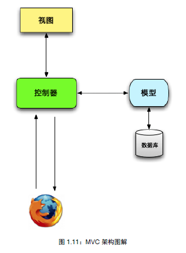
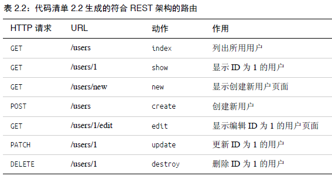

# Ruby on Rails Tutorial Note 1

Note for the book [*Ruby on Rails Tutorial*](https://www.railstutorial.org/book).

## Sample

## Note

Start：2015/2/12

### 第 1 章 从零开始，完成一次部署

脚手架 (scaffold，scaffold 还有断头台的意思) 技术，(其实就是代码自动生成技术)

#### 1.1 简介

Rails 开发了一套用于编写 Web 应用的 DSL (领域特定语言)。所以 web 编程中很多常见的任务，如生成 html，创建数据模型，url 路由，在 rails 中很容易实现且代码简洁，可读性高。

rails 最快使用 REST 架构风格。

##### 1.1.1 预备知识

略，一些在线学习资源。

##### 1.1.2 排版约定

略。

#### 1.2 搭建环境

使用云端开发环境，Cloud9：<https://c9.io/baurine>，使用 github 账号关联。

安装 rails：

    $ gem install rails -v 4.2.0

#### 1.3 第一个应用

rails 应用一般从 `rails new` 命令开始。

    $ cd ~/workspace
    $ rails _4.2.0_ new hello_app

rails 将自动创建 `hello_app` 目录，并在该目录下再创建标准的 rails 应用目录结构。(其实，android 的 adt 插件又何尝不是这样呢)

各目录的意义，略，见书表 1.2。

##### 1.3.1 Bundler

修改 Gemfile，再运行 `bundle install`。

##### 1.3.2 rails server

    $ rails server [ -b $IP -p $PORT ]

##### 1.3.3 MVC 模型

##### 1.3.4 Hello, world!

修改控制器 `app/controllers/application_controller.rb`：

    def hello
      render text: "hello, world"
    end

修改路由 `app/config/routes.rb`：

    root 'application#hello'

#### 1.4 使用 git 及推送到 bitbucket

略。

#### 1.5 布署到 heroku

暂时先跳过。

### 第 2 章 玩具应用

开发一个简单的类 twitter 应用

#### 2.1 规划应用

用户模型，微博模型，略。

#### 2.2 用户资源

用户数据模型 + web 界面 = 用户资源

使用脚手架生成：

    $ rails generate scaffold User name:string email:string

注意，User 使用单数，没有必要指定 id 字段，rails 会自动创建 id 字段。

接着用 rake 来迁移 (migrate) 数据库：

    $ bundle exec rake db:migrate

rake 是 ruby 的 make 工具。为了使用 Gemfile 中指定的 rake 版本，我们要通过 bundle exec 执行 rake，否则直接运行 rake 就行。

    $ bundle exec rake -T db //查看所有数据库相关的任务
    $ bundle exec rake -T    // 查看所有相关任务

##### 2.2.1 浏览用户相关的页面

脚手架生成用户资时生成了很多用来处理用户的页面。

    /users        列出所有用户
    /suers/1      显示 id=1 的用户
    /users/new    创建新用户
    /users/1/edit 编辑 id=1 的用户

(!!! 是不是跟 android 里的 ContentProvider 很像很像呀) (这也是所谓的 REST 风格吧)

##### 2.2.2 MVC 实战

    // app/controllers/users_controller.rb
    class UsersController < ApplicationController
      def index ...
      def show ...
      def new ...
      def edit ...
      def create ...
      def update ...
      def destroy ...

#### 2.3 微博资源

过程类似 用户资源。

##### 2.3.2 限制微博内容的长度

在 Model 中使用 validates 方法。

    // app/models/micropost.rb
    class Micropost < ApplicationRecord
      validates :content, length: { maximum: 140 }
    end

##### 2.3.3 一个用户拥有多篇微博

在数据模型之前建立关联。

    // A user has many microposts.
    // app/models/user.rb
    class User < ApplicationRecord
      has_many :microposts
    end

    // A micropost belongs to a user.
    // app/models/micropost.rb
    class Micropost < ApplicationRecord
      belongs_to :user
      validates :content, length: { maximum: 140 }
    end

通过 user_id 字段自动关联。

使用 rails 控制台。

    $ rails console
    $ first_user = User.first
    $ first_user.microposts
    $ micropost = first_user.microposts.first
    $ micropost.user

##### 2.3.4 继承体系

数据模型必须继承自 ActiveRecord::Base

控制器继承自 `ApplicationController < ActionController::Base`

存在性验证：

    class User < ActiveRecord::Base
      has_many :microposts
      validates :name, presence: true
      validates :email, presence: true
    end

### 第 3 章 基本静态的页面

#### 3.1 创建演示应用

    $ rails _4.2.0_ new sample_app

修改 Gemfile

    $ bundle install --without production
    $ bundle update

#### 3.2 生成静态页面

    $ rails generate controller StaticPages home help

生成 StaticPages 控制器，这个控制器中有 home，help 动作。StaticPages 控制器的文件名是 `static_pages_controller.rb`。

rails 的撤消操作：用 rails destroy 命令

    $ rails generate controller StaticPages home help
    $ rails destroy controller StaticPages home help
    $ rails generate model User name:string email:string
    $ rails destroy model User

对于数据库而言

    $ bundle exec rake db:migrate
    $ bundle exec rake db:rollback          // 撤消前一个迁移操作
    $ bundle exec rake db:migrate VERSION=0 //回到最初状态

rails 先执行控制器中的代码，再去渲染视图，如果控制器中的代码什么也不干，那么就只渲染视图。视图在 /views/ 目录下。

#### 3.3 开始测试

TDD：测试驱动开发。(旁注 3.3：什么时候测试!!!)

`test/controller/static_pages_controller_test.rb`

遇红--变绿--重构

    $ bundle exec rake test

#### 3.4 有点动态内容的页面

嵌入式 ruby --> .erb

    <% provide(:title, "Home") %>  // 只执行代码
    <%= yield(:title) %>           // 执行并将结果插入到这里

使用模板去除 html 的重复代码：application.html.erb

设置根路由：

    root 'static_pages#home'

#### 3.6 练习

在 `static_pages_controller_test.erb` 中使用函数减少重复代码。

    class StaticPagesControllerTest < ActionDispatch::IntegrationTest

      def setup
        @base_title = "Ruby on Rails Tutorial Sample App"
      end

      test "should get home" do
        get static_pages_home_url
        assert_response :success
        assert_select "title", "Home | #{@base_title}"
      end

setup 函数会自动执行。@ 开头的变量是实例变量，整个类可以访问。

#### 3.7 高级测试技术

暂略。回头再看。

将 spring/*.pid 加到 .gitignore

关闭 spring 进程

    $ spring stop
    $ kill -9 <pid>
    $ pkill -9 -f <name>

### 第 4 章 Ruby 基础知识

常见的数据类型和其它语言并无太多差别，关注不一样的地方。

20% 的知识点完成 80% 的功能，多用！不必深究细节，需要时再研究。

函数调用时 `()` 可以省略，如果最后一个参数是字典，字典的 `{}` 可以省略。

#### 4.2 字符串和方法

先修改配置文件

    ~/.irbrc
    IRB.conf[:PROMPT_MODE] = :SIMPLE
    IRB.conf[:AUTO_INDENT_MODE] = false

使用 ruby 控制台 (等等... 为什么不是 ruby console，而是 rails console？)

    $ rails console

双引号可以插入变量，像这样 `"#{base_title}"`，单引号里的内容为原生内容。

打印字符串：puts, print。前者自动加 `\n`。

方法后面带 ? 号，是 ruby 的约定，说明返回值是 boolean 型。`"foobar".empty?`

nil 对象。

if/unless 的使用。

定义方法：不用描述返回类型，可以返回任意类型。甚至可以不用 return。方法的返回值是最后一个语句的计算结果。

`module ApplicationHelper`，定义 module。

可以在代码中 include 其它 module。

#### 4.3 其它数据类型

##### 4.3.1 数组

和 python 的元组一样。

split, join, first, second, last, sort, sort!, reverse, shuffle, push, <<,

值域： `0..9`。和 python 中的切片，`0:9` 差不多。`(0..9).to_a`，`('a'..'e').to_a`

%w 用来创建元素为字符的数组

    %w[a b c] 
    >> ["a", "b", "c"]

##### 4.3.2 块

块是闭包。闭包是一种匿名函数，其中附带了一些数据。

两种形式，一种是 `{}`，一种是 `do ... end`。一般前者用于单行，后者用于多行。

    (0..5).each { |i| puts 2*i }

    (0..5).each do |i|
      puts 2*i
    end

    %w[a b c].map { |i| i.upcase}
    %w[a b c].map {&:upcase}

##### 4.3.3 哈希和符号

其实就是字典啦，不过这里为什么要改叫哈希，是因为它与一般的字典又有所不同，它的 key 可以不是字符串，python, php 中的字典，key 都是字符串。而 ruby 中的 key 可以用抽象的符号。

    >> user = {}                          # {} is an empty hash.
    => {}
    >> user["first_name"] = "Michael"     # Key "first_name", value "Michael"
    => "Michael"
    >> user["last_name"] = "Hartl"        # Key "last_name", value "Hartl"
    => "Hartl"
    >> user["first_name"]                 # Element access is like arrays.
    => "Michael"
    >> user                               # A literal representation of the hash
    => {"last_name"=>"Hartl", "first_name"=>"Michael"}

使用 `=>` 的定义方式：

    >> user = { "first_name" => "Michael", "last_name" => "Hartl" }
    => {"last_name"=>"Hartl", "first_name"=>"Michael"}

使用符号：

    >> "name".split('')
    => ["n", "a", "m", "e"]
    >> :name.split('')
    NoMethodError: undefined method `split' for :name:Symbol
    >> "foobar".reverse
    => "raboof"
    >> :foobar.reverse
    NoMethodError: undefined method `reverse' for :foobar:Symbol

把符号看成没有约束的字符串。但符号中不能以数字打头，不能有 '-' 等符号。

使用符号作为 key：

    >> user = { :name => "Michael Hartl", :email => "michael@example.com" }
    => {:name=>"Michael Hartl", :email=>"michael@example.com"}
    >> user[:name]              # Access the value corresponding to :name.
    => "Michael Hartl"
    >> user[:password]          # Access the value of an undefined key.
    => nil

符号很容易进行比较，字符串需要一个字符一个字符进行比较，而符号只需比较一次，这使得用符号成为 hash key 的最佳选择。(我想这是 ruby 的创新之一吧。)

因为用符号作为 hash key 实现是太常见了，于是 Ruby 1.9 干脆为这种用法定义了一种新句法：` { name: "Michael", email: "xxx" }`，等价于 ` { :name => "Michael", :email => "xxx" }`。

inspect 方法：返回对象的字面量值。

##### 4.3.4 重温引入 css 的代码

1. 调用函数时可以省略括号
1. 最后一个参数是哈希时，可以省略 `{}`

#### 4.4 Ruby 类

##### 4.4.1 构造方法

1. 字面构造方法

        >> s="foobar"
        >> s.class
        => String

1. new 方法

        >> s=Stirng.new("foobar")

##### 4.4.2 类的继承

s.class.superclass.superclass ...

String --> Objcet --> BasicObject

##### 4.4.3 修改内置的类

ruby 允许直接修改内置的类...(C# 是通过扩展方法实现的)

##### 4.4.5 用户类

    class User
      attr_accessor :name, :email     //属性访问器

      def initialize(attributes = {}) //构造函数
        @name = attributes[:name]
        @email = attributes[:email]
      end

      def formatted_email
        "#{@name} <#{@email}>"
      end
    end

#### 4.5 小结

略。

### 第 5 章 完善布局

主要是 html 和 css。

要在页面中加上 LOGO，导航条和网站底部。

#### 5.1

##### 5.1.1 网站导航

增加了 header, nav 等元素，及 ie9 的兼容解决方案。

    <body>
      <header class="navbar navbar-fixed-top navbar-inverse">
        

          <%= link_to "sample app", '#', id: "logo" %>
          <nav>
            <ul class="nav navbar-nav pull-right">
              <li><%= link_to "Home", '#' %></li>
              <li><%= link_to "Help", '#' %></li>
              <li><%= link_to "Log in", '#' %></li>
            </ul>
          </nav>
        

      </header>

      

        <%= yield %>
      

    </body>

header, nav, section 是 html 中新增的标签 (元素)。

container, navbar, navbar-fixed-top, navbar-inverse 是在 bootstrap 中定义的 css 类，稍候会引入 bootstrap 框架。

更新 home.html.erb。

    

      <h1>
        Welcome to the Sample App
      </h1>
      <h2>
        This is the home page for the
        <a href="http://www.railstutorial.org/">
          Ruby on Rails Tutorial
        </a>
        sample application.
      </h2>
      <%= link_to "Sign up now!", '#', class: "btn btn-lg btn-primary" %>
    

    <%= link_to image_tag("rails.png", alt: "Rails logo"), 'http://rubyonrails.org/' %>

在 cloud9 上用 `curl -O http://rubyonrails.org/images/rails.png` 下载图片时，只能下载到 app/asset/images 目录，在根目录下没有下载权限。

`image_tag` 生成的 html 代码：

    

##### 5.1.2 Bootstrap 和 自定义的 css

安装 bootstrap，在 rails 中可以使用 bootstrap-sass 这个 gem。bootstrap 是用 LESS 编写动态样式表，而 rails 的 Assert Pipeline 默认是支持 SASS 的。bootstrap-sass 可以把 bootstrap 由 less 转成 sass。

把 `gem 'bootstrap-sass', '3.2.0.0'` 加到 Gemfile 中。然后 bundle install。

    $ touch app/assets/stylesheets/custom.css.scss

在这个 css 中引入 bootstrap 的内容

    @import "bootstrap-sprockets";
    @import "bootstrap";

自己定义了一些 css style。略。

##### 5.1.3 使用局部视图

    <head>
      <title><%= full_title(yield(:title)) %></title>
      <%= csrf_meta_tags %>
      <%= stylesheet_link_tag    'application', media: 'all',
                                                'data-turbolinks-track': 'reload' %>
      <%= javascript_include_tag 'application', 'data-turbolinks-track': 'reload' %>
      <%= render 'layouts/shim' %>
    </head>
    <body>
      <%= render 'layouts/header' %>
      

        <%= yield %>
      

    </body>

layouts/shim 对应 layouts/_shim.html.erb。

增加 layouts/_footer.html.erb 局部视图

    <footer class="footer">
      <small>
        The <a href="http://www.railstutorial.org/">Ruby on Rails Tutorial</a>
        by <a href="http://www.michaelhartl.com/">Michael Hartl</a>
      </small>
      <nav>
        <ul>
          <li><%= link_to "About", '#' %></li>
          <li><%= link_to "Contact", '#' %></li>
          <li><a href="http://news.railstutorial.org/">News</a></li>
        </ul>
      </nav>
    </footer>

(我发现，内部链接使用了 `link_to` 方法，外部链接直接用 `<a>` 标签)

#### 5.2 Sass 和 Asset Pipeline

Asset Pipeline 用来合并 css, js 到一个文件中，并进行压缩。

资源文件：
- app/assets, lib/assets, vendor/assets
- assets/images, assets/javascripts, assets/stylesheets

rails 使用 Sprockets gem 来合并 js 和 css。

css 的合并规则写在 assets/stylesheets/application.css 中。

    *= require_tree .
    *= require_self

预处理引擎，根据后缀名决定。

- .scss --> Sass
- .coffee --> CoffeeScript
- .erb --> Ruby

##### 5.2.2 句法强大的样式表 (Sass)

最主要的两个功能：嵌套和变量

嵌套：

    footer {
      margin-top: 45px;
      padding-top: 5px;
      border-top: 1px solid #eaeaea;
      color: #777;
      a {
        color: #555;
        &: hover {
          color: #222;
      }
    }

变量：

    $light-gray: #777;

    h2 {
      ...
      color: $light-gray;
    }

bootstrap 原生使用 less 语法，定义变量语法是用 @ 打头，如 @light-gray:#777。

#### 5.3 布局中的链接

使用具名路由

    <%= link_to "About", about_path %>

##### 5.3.2 Rails 路由

    root 'static_pages#home'

会生成两个具名路由：

    root_path '/'
    root_url 'http://www.example.com/'

一般情况下，使用 `_path` 格式即可，重定向情况下使用 `_url` 格式。

    get 'help' => 'static_pages#help'

对应的两个具名路由：

    help_path '/help'
    help_url 'http://www.example.com/help'

##### 5.3.4 集成测试，测试链接

前面学习的测试只是测试单个控制器。

    $ rails generate integration_test site_layout

    class SiteLayoutTest < ActionDispatch::IntegrationTest
      test "layout links" do
        get root_path
        assert_template 'static_pages/home'
        assert_select "a[href=?]", root_path, count: 2
        assert_select "a[href=?]", help_path
        assert_select "a[href=?]", about_path
        assert_select "a[href=?]", contact_path
      end
    end

`assert_template`，`assert_select` 的使用。

    $ bundle exec rake test:integration
    $ bundle exec rake test

#### 5.4 用户注册

创建用户控制器及 new 动作。

    $ rails generate controller Users new

修改 views/users/new.html.erb

    <h1>SignUp</h>
    
...

修改路由

    get 'signup' ==> 'users#new'

修改 home.html.erb

    <%= link_to 'Sign Up Now!', signup_path, class:'btn btn-lg ...'>

修改测试文件，略。

### 第 6 章 用户模型

创建网站的用户数据模型，存储数据。

6-10 章实现整个注册，登录功能。6-8 章实现注册功能。

#### 6.1 用户模型

Active Record。其实是一种 ORM。

##### 6.1.1 数据库迁移 (migration)

创建控制器用 generate controller 命令

    $ rails generate controller Users new

创建用户模型用 generate model 命令

    $ rails generate model User name:string email:string

(!!! 注意，控制器用复数，但模型用单数。如上所示，控制器是 Users，模型是 User，但生成的表名仍是复数，即 users。因为模型是定义单条记录的格式，而表是存储多条记录。)

执行 generate model 命令后自动生成迁移文件，迁移文件的作用是创建或修改相应的数据库表结构。

    // db/migrate/[timestamp]_create_users.rb
    class CreateUsers < ActiveRecord::Migration[5.0]
      def change
        create_table :users do |t|
          t.string :name
          t.string :email

          t.timestamps
        end
      end
    end

自动生成 id, `create_at`, `update_at` 列。

使用 rake db:migration 命令来执行这个迁移

    $ bundle exec rake db:migration

撤消操作

    $ bundle exec rake db:rollback

##### 6.1.2 模型文件

    // app/models/user.rb
    class User < ActiveRecord::Base
    end

##### 6.1.3 创建用户对象

    $ rails console --sandbox
    >> User.new
    >> user = User.new(name:'baurine', email:'bao@example.com')
    >> user.valid?
    >> user.save
    >> user
    >> foo = User.create(name:'foo', email:'foo@example.com') // = new + save
    >> foo.name
    >> foo.email
    >> foo.destroy

##### 6.1.4 查找对象

    >> User.find(1)
    >> User.find_by(email: "mhartl@example.com")
    >> User.first
    >> User.all

##### 6.1.5 更新对象

    >> user.email = "mhartl@example.net"
    >> user.save
    >> user.reload.email
    >> user.update_attributes(name: "The Dude", email: "dude@abides.org")
    >> user.update_attribute(:name, "The Dude")

#### 6.2 用户数据验证

常用的数据验证：存在性、长度、格式、唯一性。

TDD 并不适合所有情况，但是模型验证是使用 TDD 的绝佳时机。

##### 6.2.1 有效性测试

    assert @user.valid?

    $ bundle exec rake test:models

##### 6.2.2 存在性验证

    test "name should be present" do
      @user.name = " "
      assert_not @user.valid?
    end

    // app/models/user.rb
    class User < ActiveRecord::Base
      validates :name, presence: true
    end

    >> user.errors.full_messages //查看错误信息
    => ["Name can't be blank"]

##### 6.2.3 长度验证

    test "name should not be too long" do
      @user.name = "a" * 51
      assert_not @user.valid?
    end

    test "email should not be too long" do
      @user.email = "a" * 256
      assert_not @user.valid?
    end

    class User < ActiveRecord::Base
      validates :name, presence: true, length: { maximum: 50 }
      validates :email, presence: true, length: { maximum: 255 }
    end

##### 6.2.4 格式验证

email 的格式验证，使用正则。

    test "email validation should reject invalid addresses" do
      invalid_addresses = %w[user@example,com user_at_foo.org user.name@example.
      foo@bar_baz.com foo@bar+baz.com]

      invalid_addresses.each do |invalid_address|
        @user.email = invalid_address
        assert_not @user.valid?, "#{invalid_address.inspect} should be invalid"
      end
    end

    class User < ActiveRecord::Base
      validates :name, presence: true, length: { maximum: 50 }
      VALID_EMAIL_REGEX = /\A[\w+\-.]+@[a-z\d\-.]+\.[a-z]+\z/i
      validates :email, presence: true, length: { maximum: 255 },
      format: { with: VALID_EMAIL_REGEX }
    end

##### 6.2.5 唯一性验证

要做两层唯一性验证，一层是在内存中生成 user 对象时，一层是把对象存入数据库时。

生成 user 对象时（注意 email 要忽略大小写）：

    test "email should be unique" do
      duplicate_user = @user.dup
      @user.save
      duplicate_user.email = @user.email.upcase
      assert_not duplicate_user.valid?
    end

    class User < ActiveRecord::Base
      validates :name, presence: true, length: { maximum: 50 }
      VALID_EMAIL_REGEX = /\A[\w+\-.]+@[a-z\d\-.]+\.[a-z]+\z/i
      validates :email, presence: true, length: { maximum: 255 },
      format: { with: VALID_EMAIL_REGEX }, uniqueness: { case_sensitive: false }
    end

写入数据库时：

为 email 建立索引，并指定其值是 unique。存入之前一律变成小写。

    $ rails generate migration add_index_to_users_email

    class AddIndexToUsersEmail < ActiveRecord::Migration
      def change
        add_index :users, :email, unique: true # add_index 方法是 rails 内置方法，添加索引
      end
    end

    $ bundle exec rake db:migrate

email 存入数据库前变成小写，使用 `before_save` 回调。

    class User < ActiveRecord::Base
      before_save { self.email = self.email.downcase }
      validates :name, presence: true, length: { maximum: 50 }
      VALID_EMAIL_REGEX = /\A[\w+\-.]+@[a-z\d\-.]+\.[a-z]+\z/i
      validates :email, presence: true, length: { maximum: 255 },
      format: { with: VALID_EMAIL_REGEX }, uniqueness: { case_sensitive: false }
    end

#### 6.3 添加安全密码

##### 6.3.1 计算密码哈希值

使用 Rails 方法， `has_secure_password`。加到 User 模型中。

    class User < ActiveRecord::Base
      ...
      has_secure_password
    end

`has_sercure_password` 要求模型中有 `password_digest` 这一列。

创建迁移文件

    $ rails generate migration add_password_digest_to_users password_digest:string

    db/migrate/[timestamp]_add_password_digest_to_users.rb
      class AddPasswordDigestToUsers < ActiveRecord::Migration
      def change
        add_column :users, :password_digest, :string
      end
    end

`has_secure_password` 使模型获得 password 和 `password_confirmation` 两个虚拟属性，即这两个属性只在内存对象中，而不存在数据库中。

`has_secure_password` 需要安装 bcrypt 这个 gem。

`has_secure_password` 还使模型获得 authenticate 方法。

##### 6.3.3 增加密码长度验证

测试文件：

    test "password should have a minimum length" do
      @user.password = @user.password_confirmation = "a" * 5
      assert_not @user.valid?
    end

在模型 User 中增加：

    validates :password, lenght: {minimum:6}

##### 6.3.4 创建并认证用户

    ...
    a_user.authenticate('foobar')

`authenticate()` 这个方法，如果验证密码成功，返回的是 `a_user` 这个对象，如果失败，返回的是布尔值 false。所以要用 `!!` 还把结果全部统一成布尔值。

    >> !!a_user.authenticate('foobar')
    => true

### 第 7 章 注册

#### 7.1 显示用户的信息

##### 7.1.1 调试信息和 rails 环境

在网页底部加上

    

      <%= yield %>
      <%= render 'layouts/footer' %>
      <%= debug(params) if Rails.env.development? %>
    

rails 三大环境：测试环境，开发环境，生产环境，详见旁注 7.1。

##### 7.1.2 用户资源

在 routes.rb 中增加一句：

    resources :users

自动生成以下路由：

在 app/views/users 目录下新建 show.html.erb，写入

    <%= @user.name %>, <%= @user.email %>

而 @user 的值来自 Users 控制器，在 app/controllers/users_controller.rb 中，写入

    def show
      @user = User.find(params[:id])
    end

##### 7.1.3 调试器

byebug gem。

相当于断点调试器。在想断点的地方加上 debugger。访问网页的时候控制台就会在这个地方断下来，nb~!

##### 7.1.4 Gravatar 头像和侧边栏

用 aside 标签定义侧边栏。aside 中的内容一般是对主体内容的补充 (如侧边栏)。把 class 设为 `row col-md-4` (都是 bootstrap 提供的)。

#### 7.2 注册表单

先把后台创建的用户删掉

    $ bundle exec rake db:migrate:reset

创建表单，使用 `form_for` 方法。

心得：

- Rails 的 MVC，控制器 C 作为中枢，负责和 M，V 联系。M 和 V 之间没有任何联系，是相互隔离的。这和客户端的 MVC 有所不一样，客户端的 MVC，M 和 V 是可以相互通信的。
- 一个控制器中的一个动作，默认有一个同名的 view。
- 模型是独立的，控制器中的任何一个动作，都可以操作任意一个模型。

再次回顾这个图。

在这里，注册的路由 /signup 对应的是 Users 控制器下的 new 动作。

    // app/config/routes.rb
    get 'signup' => 'Users#new'

所以，我们首先要在 Users#new 动作里，创建一个 User 模型的对象，然后传到 app/views/users/new.html.erb views 中渲染。

    // app/controllers/users_controller.rb
    def new
      @user = User.new
    end

    // app/views/users/new.html.erb
    <% provide(:title,'SignUp') %>

    <h1>Sign Up</h1>

      

      

        <%= form_for(@user) do |f| %>
          <%= f.label :name %>
          <%= f.text_field :name %>
          <%= f.label :email %>
          <%= f.text_field :email %>
          <%= f.label :password %>
          <%= f.password_field :password %>
          <%= f.label :password_confirmation, "Confirmation" %>
          <%= f.password_field :password_confirmation %>
          <%= f.submit "Create my account", class: "btn btn-primary" %>
        <% end %>
      

    

生成的 html 代码：

    

      

        <form class="new_user" id="new_user" action="/users" accept-charset="UTF-8" method="post"><input name="utf8"
        type="hidden" value="&#x2713;" /><input type="hidden" name="authenticity_token" value="6P6s7x1cQTRls65gB+98wKQnD5M
        +Kqv4/WnIR1FEVo906eUP43qqMjCXRIbPwyqOe5e893FwIE+RZjPvqZbnjw==" />
          <label for="user_name">Name</label>
          <input type="text" name="user[name]" id="user_name" />
          <label for="user_email">Email</label>
          <input type="text" name="user[email]" id="user_email" />
          <label for="user_password">Password</label>
          <input type="password" name="user[password]" id="user_password" />
          <label for="user_password_confirmation">Confirmation</label>
          <input type="password" name="user[password_confirmation]" id="user_password_confirmation" />
          <input type="submit" name="commit" value="Create my account" class="btn btn-primary" />
        </form>
      

    

修改样式，略。

##### 7.2.2 注册表单的 html

分析 `form_for` 辅助方法。

    <form action="/users" class="new_user" id="new_user" method="post">

#### 7.3 注册失败

    def create
      @user = User.new(params[:user])
      if @user.save
        puts 'save ok' # in fact shold be redirect to another url
      else
        render 'new'
      end
    end

在注册页面随便填了一些内容后，点击"Create my account"，页面出错。从 log 来看，出错的原因是批量赋值导致的。

##### 7.3.2 健壮参数

在 Rails 4.0 以后，使用健壮参数解决上面的问题。

    params.require(:user).permit(:name, :email, :password, :password_confirmation)

##### 7.3.3 注册失败错误消息

    >> user.errors.full_messages
    => ["Email is invalid", "Password is too short (minimum is 6 characters)"]

    <%= form_for(@user) do |f| %>
      <%= render 'shared/error_messages' %>
      <%= f.label :name %>
      <%= f.text_field :name, class:'form-control' %>

##### 7.3.4 注册失败的测试 (自动化测试的重要性!)

生成一个集成测试文件

    $ rails generate integration_test users_signup

    class UsersSignupTest < ActionDispatch::IntegrationTest
      test 'invalid signup information' do
        get signup_path
        assert_no_difference 'User.count' do
          post users_path, user: { name: "",
                                  email: "user@invalid",
                                  password: "foo",
                                  password_confirmation: "bar" }
        end
        assert_template 'users/new'
      end
    end

#### 7.4 注册成功

保存成功后重定向到显示用户资料界面。

##### 7.4.1 完整的注册表单

    def create
      @user = User.new(new_params)
      if @user.save
        puts @user.id
        redirect_to @user 
        # 是因为当前类是 UsersController，所以 redirect_to 知道是重定向到 /users/id ??
        # 哦，原来这是 redirect_to user_url(@user) 的简写
      else
        render 'new'
      end
    end

##### 7.4.2 闪现消息

    flash[:success] = "Welcome to the Sample App!"

    // application.html.erb
    <body>
      <%= render 'layouts/header' %>
      

        <% flash.each do |message_type, message| %>
          
"><%= message %>

        <% end %>
        <%= yield %>
        <%= render 'layouts/footer' %>
        <%= debug(params) if Rails.env.development? %>
      

    </body>

bootstrap 提供的 css 样式支持四种闪现消息样式，success, info, warning, danger。

##### 7.4.3 首次注册

效果：首次注册成功后，显示 flash message，刷新后不显示。

##### 7.4.4 注册成功的测试

    test 'valid signup information' do
      get signup_path
      name = "example"
      email = "user@example.com"
      password = "1234567"
      assert_difference 'User.count', 1 do
      post_via_redirect users_path, user: { name: name,
                                            email: email,
                                            password: password,
                                            password_confirmation: password }
      end
      assert_template 'users/show'
    end

问题，测试成功后，为什么这个用户的信息没有存入数据库呢 (通过 rails console 查看了确实没有) 它是怎么做到的啊? 因为测试时用的是测试数据库，不是开发数据库。

#### 7.5 专业布署方案

##### 7.5.1 在生产环境中使用 SSL (Secure Socket Layer)

    config/environments/production.rb
    # Force all access to the app over SSL, use Strict-Transport-Security, and use secure cookies.
    config.force_ssl = true

##### 7.5.2 在生产环境中使用 Unicorn

Heroku 默认使用纯 ruby 实现的 WEBrick，它易于搭建，但不能很好地处理蔬大流量，因此在生产环境中，要使用能处理大量请求的 Unicorn。

    // Gemfile
    group :production do
      gem 'pg', '0.17.1'
      gem 'rails_12factor', '0.0.2'
      gem 'unicorn', '4.8.3'
    end

剩余略，粗略看看。需要时再回头看。

#### 7.7 练习

略。

### 第 8 章 登录和退出

网络中三种常见的方式实现登录退出：

1. 浏览器关闭后**忘记**用户的登录状态
1. 自动记住用户的登录状态
1. 勾选**记住我**时才记住用户的登录状态

#### 8.1 会话

HTTP 协议 没有状态，每个请求都是独立的。

需要用户登录的应用都要使用**会话** (session)。最常见的方法是使用 cookie。

##### 8.1.1 会话控制器

登录和退出功能由会话控制器中的相应动作处理。登录表单在 new 动作中处理，登录的过程是向 create 动作发送 post 请求，退出则是向 destroy 动作发送 delete 请求。

生成会话控制器 和 new 动作 (同时会生成 new 视图)。

    $ rails generate controller Session new

修改路由。用户资源使用特殊的 resources 方法自动获得得符合 REST 架构的路由，会话资源只能使用具名路由。

    get    'login'  => 'sessions#new'
    post   'login'  => 'sessions#create'
    delete 'logout' => 'sessions#destroy'

查看所有路由

    $ bundle exec rake routes

##### 8.1.2 登录表单

与注册页面类似，但由于会话不是模型，因此不能创建 @user 的变量。因此不能直接用 `form_for(@user)`，必须指定更详细的参数。如：`form_for(:session, url: login_path)`。

    <%= form_for(:session, url:login_path) do |f| %>
      <%= f.label :email %>
      <%= f.text_field :email%>
      <%= f.label :password %>
      <%= f.password_field :password%>
      <%= f.submit "Log in", class: "btn btn-primary" %>
    <% end %>

##### 8.1.3 查找并认证用户

##### 8.1.4 显示 flash 消息

    def create
      user = User.find_by(email: params[:session][:email].downcase)
      if user && user.authenticate(params[:session][:password])
        # login ok
      else
        # login failed
        # print error message
        flash[:danger]="Invalid email/password combination" # 有点小问题
        render 'new'
      end
    end

render 和**重定向**不一样，不算一次新的请求。因此上面的处理会导致 flash 停留的时间过长。

##### 8.1.5 测试闪现消息

    $ rails generate integration_test users_login

    class UsersLoginTest < ActionDispatch::IntegrationTest
      test "login with invalid information" do
        get login_path
        assert_template 'sessions/new'
        post login_path, session:{email:"", password:""}
        assert_template 'sessions/new'
        assert_not flash.empty?
        get root_path
        assert flash.empty?
      end
    end

    $ bundle exec rake test TEST=test/integration/users_login_test.rb # 单独测试某个文件的方法

测试不通过。

解决办法，把

    flash[:danger]="Invalid email/password combination" # 有点小问题

改成

    flash.now[:danger]="Invalid email/password combination"

#### 8.2 登录

本节通过临时会话让用户登录，浏览器关闭后会话自动失效。

在控制器的基类 ApplicationController 中引入辅助方法模块。

    class ApplicationController < ActionController::Base
      protect_from_forgery with: :exception
      include SessionsHelper
    end

##### 8.2.1 `log_in` 方法

    module SessionsHelper
      def log_in(user)
        session[:user_id] = user.id
      end
    end

这里 `session[:user_id]` 会自动加密 (怎么做到? Rails 自带?)。

在控制器里调用 `log_in` 方法

    if user && user.authenticate(params[:session][:password])
      # login ok
      log_in user
      redirect_to user

##### 8.2.2 当前用户

在 SessionsHelper 中定义

    def current_user
      @current_user ||= User.find_by(id: session[:user_id])
    end

##### 8.2.3 修改布局中的链接

登录成功以后，改变 header 部分的布局。

使用了 bootstrap 的下拉菜单，需要在 application.js 中引入 bootstrap 的 js 库。

    app/assets/javascripts/application.js
    //= require bootstrap

修改 `_header.html.erb`：

    <% if logged_in? %>
      <li><%= link_to "Users", "#"%></li>
      <li class="dropdown">
      <a href="#" class="dropdown-toggle" data-toggle="dropdown">
      Accout <b class="caret"></b>
      </a>
      <ul class="dropdown-menu">
        <li><%= link_to "Profile", current_user %></li>
        <li><%= link_to "Settings", "#" %></li>
        <li class="divider"></li>
        <li><%= link_to "Log out", logout_path, method: "delete" %></li>
      </ul>
      </li>
    <% else %>
      <li><%= link_to "Log in", login_path %></li>
    <% end %>

##### 8.2.4 测度布局中的变化

定义类方法：

    // app/models/user.rb
    class User < ActiveRecord::Base
      ...
      def User.digest(password)
        cost = ActiveModel::SecurePassword.min_cost ? BCrypt::Engine::MIN_COST : BCrypt::Engine.cost
        BCrypt::Password.create(password, cost: cost)
      end
    end

定义 fixtures：

    // app/test/fixtures/users.yml
    michael:
      name: Michael
      email: michael@example.com
      password_digest: <%= User.digest("1234567") %>

在测试中使用 fixtures：

    class UsersLoginTest < ActionDispatch::IntegrationTest
      def setup
        @user = users(:michael)
      end

      ...
      test "login with valid information" do
        get login_path
        assert_template 'sessions/new'
        post login_path, session:{email:@user.email, password:"1234567"}
        assert_redirected_to @user
        follow_redirect!
        assert_template 'users/show'
        assert_select 'a[href=?]', login_path, count: 0
        assert_select 'a[href=?]', logout_path
        assert_select 'a[href=?]', user_path(@user)
      end
    end

`assert_redirect_to @user` 用于检查重定向是否正确。`follow_redirect!` 用于访问重定向后的地址。

指定测试某个测试文件中的某个测试，使用选项 TEST 和 TESTOPTS。

    $ bundle exec rake test TEST=test/integration/users_login_test.rb \
    > TESTOPTS="--name test_login_with_valid_information"

##### 8.2.5 注册后直接登录

注册成功后调用 `log_in` 方法，保存 user.id 到 session 中。同时更新测试文件。

#### 8.3 退出

在 SessionContrller 的 destroy 动作中，将 `user_id` 从 session 中删除，然后重定向到 `root_path`

### 8.4 记住我

使用 cookie

为 User 模型加上 `remember_digest` 列。

    $ rails generate migration add_remember_digest_to_users remember_digest:string

    class AddRememberDigestToUsers < ActiveRecord::Migration
      def change
        add_column :users, :remember_digest, :string
      end
    end

    $ bundle exec rake db:migrate

用什么做记忆令牌。ruby 的 SecureRandom 模块的 `urlsafe_base64` 方法。这个方法返回长度为 22 的随机字符串。

    $ rails console
    > SecureRandom.urlsafe_base64
    => "EeI8UNf0MC2w4LlF9U79Qw"

在 User 类中定义此方法

    # 返回一个随机令牌
    def User.new_token
      SecureRandom.urlsafe_base64
    end

在数据库中记住用户。使用虚拟属性，使用 attr_accessor 关键字。

    class User < ActiveRecord::Base
      attr_accessor :remember_token
      ...
      # 为了持久会话，在数据库中记住用户
      def remember
        self.remember_token = User.new_token
        update_attribute(:remember_digest, User.digest(remember_token))
      end
    end

##### 8.4.2 登录时记住登录状态

使用 cookies 方法，类似 session，也是一个哈希表。

    // permanent 是辅助方法
    cookies.permanent[:remember_token] = remember_token
    // 不能存 user.id 的明文，signed 是可逆的， signed 后再次 signed 得到原值
    cookies.permanent.signed[:user_id] = user.id

从 cookie 取出 user_id，查找用户

    User.find_by(id: cookies.signed[:user_id])

对比 `remember_token` 和 `remember_digest`

    // app/models/user.rb
    # 验证 token 和 digest
    def authenticated(remember_token)
      BCrypt.Password.new(remember_digest).is_password?(remember_token)
    end

在 SessionHelper 中定义 remember 方法

    def remember(user)
      user.remember
      cookies.permanet.signed[:user_id]=user.id
      cookies.permanet[:remember_token]=user.remember_token
    end

?? 不理解啊，rails 代码不是跑在服务器上的吗，而存储 cookies 的行为应该是浏览器才能做的呀，应该调用 js 完成才对吧。
(现在明白了，在 rails 代码中定义好了 cookie 的内容后，这些内容会出现在 http response 的 header 中，浏览器会负责把 header 中的 cookie 存储到本地，并且在每次发起 Http request 时带上把本地的 cookie 带在 header。)

在 SessionController 中登录成功后，调用 remember 方法

    def create
      user = User.find_by(email: params[:session][:email].downcase)
      if user && user.authenticate(params[:session][:password])
        # login ok
        log_in user
        remember user
        redirect_to user

这时，我终于明白所谓的前面加了 @ 后就成了什么实例变量，比如 @user。这种变量其实就是类的成员变量啦，在类的各个函数中可以调用。如果不加 @，那就是局部变量了，只可以在函数内部使用。

重新定义 SessionHelper 中的 `current_user` 方法

    def current_user
      if (user_id = session[:user_id])
        @current_user ||= User.find_by(id: user_id)
      elsif (user_id = cookies.signed[:user_id])
        user = User.find_by(user_id)
        if user && user.authenticated(cookies[:remember_token])
          log_in user
          @current_user = user
        end
      end
    end

##### 8.4.3 忘记用户

在 User 模型中定义 forget 方法，更新 `remember_digest` 为 nil

    # 忘记用户
    def forget
      update_attribute(:remember_digest, nil)
    end

在 SessionHelper 中定义 forget 方法，清除 cookies。退出时调用 forget 方法。

    # 忘记持久会话
    def forget(user)
      user.forget
      cookies.delete(:user_id)
      cookies.delete(:remember_token)
    end

    # 退出时忘记用户
    def log_out
      forget(current_user)
      session.delete(:user_id)
      @current_user = nil
    end

##### 8.4.4 两个小问题

解决在多个窗口或多个浏览器中同时访问，一个退出后，另一个再退出时会出现错误的问题。

通过这一小节，解决我一个疑惑。我平时在家登录水木，明明是勾选了记住，可以有时回来后一登，还是要我输用户名和密码。现在知道原因了，因为我后来又在公司登录了，这样就改变了服务器上的信息，再回到家登录，cookies 中的内容就无效了。

所以这种用 cookies 来实现记住我的效果，只能限定在一台机器上的同一个浏览器使用，只要在另一台机器或另一个浏览器中登录过，该 cookie 就会失效。

##### 8.4.5 记住我 复选框

加一个 checkbox。然后在登录后，根据这个值，如果为 1 就 remember，否则 forget。

##### 8.4.6 测试记住我功能

    defined?
    assert_not_nil
    assert_nil

测试"记住"分支。"我最喜欢在未测试中的代码块中抛出异常"。抛出异常用 raise。

#### 8.6 练习

- assigns 方法。
- 定义静态方法的另两种方法。

### 第 9 章 更新，显示和删除用户

这章完成用户资源的所有 REST 动作。包括 edit, update, index, destroy。

创建管理员。

#### 9.1 更新用户

##### 9.1.1 创建表单

在 UsersController 控制器中增加 edit 动作。内容和 new 动作一样。

    def edit
      @user = User.find(params[:id])
    end

在 views 目录下创建 edit.html.erb 页面，内容与 new.html.erb 基本相同。也是一个表单。

    <a href="http://gravatar.com/emails" target="_blank">change</a>

`target="_blank"` 表示在新窗口中打开链接。

查看表单 `form_for` 生成的 html 源代码，发现一段代码：

    <input type="hidden" name="_method" value="patch" />

因为浏览器不支持 patch 请求，所以 rails 用这样一种方法来曲线实现 patch 请求。

`form_for` 在生成表单的 html 代码时，怎么知道在新建时是发送 post 请求，而在编辑时是发送 patch 请求呢。通过 Active Record 提供的 `new_record?` 方法来知道是新建用户还是更新用户。

    $ rails console
    >> User.new.new_record?
    => true
    >> User.first.new_record?
    => false

##### 9.1.2 编辑表单失败的处理

和注册新用户时一样的处理。逻辑写在 UsersController 的 update 动作中。内容与 create 动作差不多。

    def update
      @user = User.find(params[:id])
      if @user.update_attributes(new_params)
        redirect_to @user
      else
        render 'edit'
      end
    end

##### 9.1.3 测试编辑表单失败

使用集成测试。

    test "unsuccessful edit" do
      get edit_user_path(@user)
      patch user_path(@user), user: {name: '',
                                     email: 'foobar@example.com',
                                     password: 'foo',
                                     password_confirmation: 'bar'}
      assert_template 'users/edit'
    end

##### 9.1.4 测试编辑表单成功（使用 TDD）

    test "successful edit" do
      get edit_user_path(@user)
      name = "Foo"
      email = "bar@example.com"
      patch user_path(@user), user: {name: name,
                                     email: email,
                                     password: '',
                                     password_confirmation: ''}
      assert_not flash.empty?
      assert_redirected_to @user
      @user.reload
      assert_equal @user.name, name
      assert_equal @user.email, email
    end

#### 9.2 权限系统

##### 9.2.1 必须先登录

使用事前过滤器。其实相当于一种回调，在登录前调用一个方法。插件思想。又类似于 Android 的 activity 的 `onCreate()` 方法。

    class UsersController < ApplicationController
      before_action :logged_in_user, only:[:edit, :update]

      ...
      private
        # 事前过滤器
        # 确保已登录
        def logged_in_user
          unless logged_in?
          flash[:danger] = "Please log in first!"
          redirect_to login_url
        end
    end

但是目前有漏洞，任意一个用户只要登录后就能编辑其它任何人的资料。因为它只判断了是否，而没有判断要修改的人是否是自己。

测试：在测试 edit user 时先用 `log_in_as(@user)` 进行登录

##### 9.2.2 用户只能编辑自己的资料

先写测试文件。在 fixtures 中新增一个测试用户。

    fixtures/users.yml
    michael:
      name: Michael
      email: michael@example.com
      password_digest: <%= User.digest("1234567") %>

    archer:
      name: Archer
      email: archer@example.com
      password_digest: <%= User.digest("1234567") %>

在 `users_controller_test.rb` 中增加测试代码：

    test "should redirect edit when edit different user" do
      log_in_as(@other_user)
      get :edit, id: @user
      assert_redirected_to root_url
    end

    test "should redirect update when update different user" do
      log_in_as(@other_user)
      patch :update, id: @user, user: {name:@user.name, email:@user.email}
      assert_redirected_to login_url
    end

在 `users_controller` 中增加事前过滤器：

    before_action :correct_user, only:[:edit, :update]
      ...

    # 事前过滤器，确保是当前用户
    def correct_user
      @user = User.find(params[:id])
      redirect_to(root_url) unless current_user?(@user)
    end

##### 9.2.3 实现友好的转向

方法是在转向之前把当前 url 保存起来，需要转向时再把之前保存到 url 取出来，并转向到此 url。保存在 session 中。注意写测试文件。

#### 9.3 列出所有用户

##### 9.3.1 用户列表

只允许登录用户查看。

    // index.html.erb
    <ul class="users">
      <% @users.each do |user| %>
        <li>
        <%= gravatar_for user, size:50 %>
        <%= link_to user.name, user %>
        </li>
      <% end %>
    </ul>

##### 9.3.2 示例用户

用 rails 产生大量模拟用户。用 faker gem 可以产生模拟的名字。

rails 使用 db/seeds.rb 来向数据库中添加示例用户

    User.create!(name:"Example",
                email: "example@railstutorial.org",
                password: "foobar",
                password_confirmation: "foobar")

    99.times do |n|
      name = Faker::Name.name
      email = "example-#{n}@railstutorial.org"
      password = "1234567"
      User.create!(name: name,
      email: email,
      password: password,
      password_confirmation: password)
    end

create! 方法和 create 类似，但出错时不是返回 false，而是抛出异常。

导入数据库

    $ bundle exec rake db:migrate:reset
    $ bundle exec rake db:seed

##### 9.3.3 分页

Rails 中实现分页的方法之一，`will_paginate`。

需要使用 `will_paginate` 和 `bootstrap-will_paginate` 两个 gem。

    // index.html.erb
    <%= will_paginate %>

    // users_controller.rb
    def index
      @users = User.paginate(page: params[:page])
    end

##### 9.3.4 列表页的测试

同样的，在 fixtures/users.yml 中模拟生成多个用户。然后为 `users_index` 编写集成测试代码。

在 fixture/user.yml 中增加以下代码后，导致测试有一个失败。不知为何? 待追查。

    <% 30.times do |n| %>
      user_<%= n %>:
        name: <%= "User #{n}" %>
        email: <%= "user-#{n}@example.com" %>
        password_digest: <%= User.digest('password') %>
    <% end %>

##### 9.3.5 使用局部视图重构

#### 9.4 删除用户

destroy 动作。首先创建管理员账户。

##### 9.4.1 管理员

为用户模型增加一个 admin 属性，类型为 boolean，从而会自动生成 admin? 方法。

    $ rails generate migration add_admin_to_users admin:boolean

修改迁移文件，增加默认值为 false 的选项。

    class AddAdminToUsers < ActiveRecord::Migration
      def change
        add_column :users, :admin, :boolean, default: false
      end
    end

修改 db/seeds.rb，把第一个用户设置为 admin。

重置数据库。

安全性问题：如果没有安全措施，用户通过工具发送 `patch /users/17?admin=true` 的请求，就可以把自己修改了管理员。我们前面的代码中，在接收用户的参数时，有一层过滤，只接收我们想要的参数，就可以把这个安全隐患排除。即

    def user_params
      params.require(:user).permit(:name, :email, :password, :password_confirmation)
    end

由于网站的特殊性，所有 url 是对外公开可见的，所以安全是头等大事。一定要把权限管理做得很好。

##### 9.4.2 destroy 动作

当登录用户为管理员时，可以看到用户列表中的删除按钮。(不能删除自己) 

为 destroy 增加事前过滤器，确保已登录且是管理员，以避免安全问题。

##### 9.4.3 删除的测试

先在 fixtures/usres.yml 中把第一个用户设为管理员。

然后在 `users_controller_test` 中测试 destroy 失败的情况。

然后在 `users_index_test` 中进行集成测试，测试页面元素，及 destroy 成功的情况。

可见，在控制器测试中只测试逻辑，而在集成测试中还进行页面元素的测试。

#### 9.5 小结

!!! 学到的最重要的，使用健壮参数和事前过滤器，提升网站的安全。

#### 9.6 练习

1. 测试 admin 属性不能被修改
1. 抽取 new 和 edit 页面中的重复布局

### 第 10 章 账户激活和密码重设

#### 10.1 账户激活

步骤：略。

##### 10.1.1 资源

1. 生成 AccountActivations 控制器
1. 为 edit 动作指定具名路由：`resources :account_activations, only: [:edit]`
1. 数据库迁移，增加 `activation_digest`, `activated`, `activated_at` 列
1. 为 `before_create` 指定回调函数：`create_activation_digest`。在创建新用户前生成 `activation_digest`
1. 为 User 模型增加 `activation_token` 虚拟属性。
1. 为种子用户(db/seeds.rb) 和 fixtures/users.yml 指定 `activated` 和 `activated_at` 属性值。

##### 10.1.2 邮件程序

!!! 教程已经过时了...

大致明白了。

1. 生成 mailer

        $ rails generate mailer UserMailer accout_activation password_reset

   与控制器类似，同时生成 `accout_activation` 和 `password_reset` 两个视图模版，有 text 和 html 两种格式。

1. 修改 UserMailer::account_activation 方法和相应的视图模版

        def account_activation(user)
          @user = user
          mail to: user.email, subject: "Account activation"
        end

   具名路由

        edit_account_activation_url(@user.activation_token, email: @user.email)

   生成的 url：

        account_activations/q5lt38hQDc_959PVoo6b7A/edit?email=foo%40example.com

   token 部分的内容通过 params[:id] 获得，参数部分通过 params[:email] 获得。

   !!! 所以这里有一个问题，参数部分不可以用 id 作为 key 值。

1. 设置开发环境邮件环境

        config/environments/development.rb
        config.action_mailer.raise_delivery_errors = true
        config.action_mailer.delivery_method = :test
        host = 'example.com'
        config.action_mailer.default_url_options = { host: host }

1. 修改邮件预览程序

        // test/mailers/previews/user_mailer_preview.rb
        def account_activation
          user = User.first
          user.activation_token = User.new_token
          UserMailer.account_activation(user)
        end

1. 测试，同时要修改 测试环境的邮件环境

   用 assert_match 进行文本匹配，支持正则。

        assert_match CGI::escape(user.email), mail.body.encoded

1. 注册过程中添加激活账号代码

        // app/controllers/users_controller.rb
        def create
          @user = User.new(new_params)
          if @user.save
            UserMailer.account_activation(@user).deliver_now
            flash[:info] = "Please check your email to activate your accout"
            redirect_to root_url
          else
            #puts 'save failed'
            render 'new'
          end
        end

##### 10.1.3 激活账户

1. 使用 ruby 元编程改写 User.authenticated 方法。使用 send 方法可以调用任意其它方法和属性。 (感觉像是和 js 的 apply 类似，其实到 c++ 层次就是函数指针啦)。

        a.length
        a.send(:length)
        a.send('length)

        def authenticated?(attribute, token)
          #puts "***************#{remember_digest}$$$$$$$$$$$$$$$$"
          digest = send("#{attribute}_digest")
          return false if digest.nil?
          BCrypt::Password.new(digest).is_password?(token)
        end

1. 编写 AccountActivationController 的 edit 动作。

   判断是否激活，未激活，则更新属性为激活，跳转到用户信息界面。否则提示错误，跳转到主页。

1. 禁止未激活的用户登录。

#### 10.1.4 测试和重构

1. 测试
1. 重构：把 activate 逻辑和发送邮件的逻辑从控制器中移到 User 模型中

#### 10.2 密码重设

步骤：略。

##### 10.2.1 资源

1. 生成 PasswordReset 控制器

        $ rails generate controller PasswordReset new edit --no-test-framework

1. 指定路由

        resources :password_reset only: [:new, :create, :edit, :update]

1. 在登录界面添加忘记密码的链接

        <%= link_to "(Forgot password)", new_password_reset_path %>

1. 添加数据迁移，添加 `reset_digest` 和 `reset_sent_at` 列

##### 10.2.2 控制器和表单

1. 修改 new.html.erb，实现填写邮件地址的表单
1. 实现 `password_reset` 的 create 动作
1. 在 user 模型中增加修改密码所需方法

##### 10.2.3 邮件程序

与激活账户差不多

1. 修改 user_mail 中 password_reset 方法
1. 修改邮件视图
1. 修改预览
1. 测试

##### 10.2.4 重设密码

1. 在 edit 视图中实现修改密码的表单，同时把用户的邮件地址隐藏中表单中提交。使用 `<%= hidden_field_tag ... %>`
1. 事前过滤器：`get_user`, `valid_user`, `check_reset_expiration`
1. 实现 update 动作

##### 10.2.5 测试

略。

剩余部分见 [Note 2](./ruby-on-rails-tutorial-note-2.md)。
