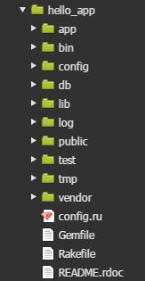

# Ruby on Rails Tutorial - Note 1

Note for the book [*Ruby on Rails Tutorial*](https://www.railstutorial.org/book).

## Sample

## Note

Start：2015/2/12

### 第 1 章 从零开始，完成一次部署

脚手架 (scaffold，scaffold 还有断头台的意思) 技术，(其实就是代码自动生成技术)

#### 1.1 简介

Rails 开发了一套用于编写 Web 应用的 DSL (领域特定语言)。所以 web 编程中很多常见的任务，如生成 html，创建数据模型，url 路由，在 rails 中很容易实现且代码简洁，可读性高。

rails 最快使用 REST 架构风格。

##### 1.1.1 预备知识

略，一些在线学习资源。

##### 1.1.2 排版约定

略。

#### 1.2 搭建环境

使用云端开发环境，Cloud9：<https://c9.io/baurine>，使用 github 账号关联。

安装 rails：

    $ gem install rails -v 4.2.0

#### 1.3 第一个应用

rails 应用一般从 `rails new` 命令开始。

    $ cd ~/workspace
    $ rails _4.2.0_ new hello_app

rails 将自动创建 `hello_app` 目录，并在该目录下再创建标准的 rails 应用目录结构。(其实，android 的 adt 插件又何尝不是这样呢)

各目录的意义，略，见书表 1.2。

##### 1.3.1 Bundler

修改 Gemfile，再运行 `bundle install`。

##### 1.3.2 rails server

    $ rails server [ -b $IP -p $PORT ]

##### 1.3.3 MVC 模型

##### 1.3.4 Hello, world!

修改控制器 `app/controllers/application_controller.rb`：

    def hello
      render text: "hello, world"
    end

修改路由 `app/config/routes.rb`：

    root 'application#hello'

#### 1.4 使用 git 及推送到 bitbucket

略。

#### 1.5 布署到 heroku

暂时先跳过。

### 第 2 章 玩具应用

开发一个简单的类 twitter 应用

#### 2.1 规划应用

用户模型，微博模型，略。

#### 2.2 用户资源

用户数据模型 + web 界面 = 用户资源

使用脚手架生成：

    $ rails generate scaffold User name:string email:string

注意，User 使用单数，没有必要指定 id 字段，rails 会自动创建 id 字段。

接着用 rake 来迁移 (migrate) 数据库：

    $ bundle exec rake db:migrate

rake 是 ruby 的 make 工具。为了使用 Gemfile 中指定的 rake 版本，我们要通过 bundle exec 执行 rake，否则直接运行 rake 就行。

    $ bundle exec rake -T db //查看所有数据库相关的任务
    $ bundle exec rake -T    // 查看所有相关任务

##### 2.2.1 浏览用户相关的页面

脚手架生成用户资时生成了很多用来处理用户的页面。

    /users        列出所有用户
    /suers/1      显示 id=1 的用户
    /users/new    创建新用户
    /users/1/edit 编辑 id=1 的用户

(!!! 是不是跟 android 里的 ContentProvider 很像很像呀) (这也是所谓的 REST 风格吧)

##### 2.2.2 MVC 实战

    // app/controllers/users_controller.rb
    class UsersController < ApplicationController
      def index ...
      def show ...
      def new ...
      def edit ...
      def create ...
      def update ...
      def destroy ...

#### 2.3 微博资源

过程类似 用户资源。

##### 2.3.2 限制微博内容的长度

在 Model 中使用 validates 方法。

    // app/models/micropost.rb
    class Micropost < ApplicationRecord
      validates :content, length: { maximum: 140 }
    end

##### 2.3.3 一个用户拥有多篇微博

在数据模型之前建立关联。

    // A user has many microposts.
    // app/models/user.rb
    class User < ApplicationRecord
      has_many :microposts
    end

    // A micropost belongs to a user.
    // app/models/micropost.rb
    class Micropost < ApplicationRecord
      belongs_to :user
      validates :content, length: { maximum: 140 }
    end

通过 user_id 字段自动关联。

使用 rails 控制台。

    $ rails console
    $ first_user = User.first
    $ first_user.microposts
    $ micropost = first_user.microposts.first
    $ micropost.user

##### 2.3.4 继承体系

数据模型必须继承自 ActiveRecord::Base

控制器继承自 `ApplicationController < ActionController::Base`

存在性验证：

    class User < ActiveRecord::Base
      has_many :microposts
      validates :name, presence: true
      validates :email, presence: true
    end

### 第 3 章 基本静态的页面

#### 3.1 创建演示应用

    $ rails _4.2.0_ new sample_app

修改 Gemfile

    $ bundle install --without production
    $ bundle update

#### 3.2 生成静态页面

    $ rails generate controller StaticPages home help

生成 StaticPages 控制器，这个控制器中有 home，help 动作。StaticPages 控制器的文件名是 `static_pages_controller.rb`。

rails 的撤消操作：用 rails destroy 命令

    $ rails generate controller StaticPages home help
    $ rails destroy controller StaticPages home help
    $ rails generate model User name:string email:string
    $ rails destroy model User

对于数据库而言

    $ bundle exec rake db:migrate
    $ bundle exec rake db:rollback          // 撤消前一个迁移操作
    $ bundle exec rake db:migrate VERSION=0 //回到最初状态

rails 先执行控制器中的代码，再去渲染视图，如果控制器中的代码什么也不干，那么就只渲染视图。视图在 /views/ 目录下。

#### 3.3 开始测试

TDD：测试驱动开发。(旁注 3.3：什么时候测试!!!)

`test/controller/static_pages_controller_test.rb`

遇红--变绿--重构

    $ bundle exec rake test

#### 3.4 有点动态内容的页面

嵌入式 ruby --> .erb

    <% provide(:title, "Home") %>  // 只执行代码
    <%= yield(:title) %>           // 执行并将结果插入到这里

使用模板去除 html 的重复代码：application.html.erb

设置根路由：

    root 'static_pages#home'

#### 3.6 练习

在 `static_pages_controller_test.erb` 中使用函数减少重复代码。

    class StaticPagesControllerTest < ActionDispatch::IntegrationTest

      def setup
        @base_title = "Ruby on Rails Tutorial Sample App"
      end

      test "should get home" do
        get static_pages_home_url
        assert_response :success
        assert_select "title", "Home | #{@base_title}"
      end

setup 函数会自动执行。@ 开头的变量是实例变量，整个类可以访问。

#### 3.7 高级测试技术

暂略。回头再看。

将 spring/*.pid 加到 .gitignore

关闭 spring 进程

    $ spring stop
    $ kill -9 <pid>
    $ pkill -9 -f <name>

### 第 4 章 Ruby 基础知识

常见的数据类型和其它语言并无太多差别，关注不一样的地方。

20% 的知识点完成 80% 的功能，多用！不必深究细节，需要时再研究。

函数调用时 `()` 可以省略，如果最后一个参数是字典，字典的 `{}` 可以省略。

#### 4.2 字符串和方法

先修改配置文件

    ~/.irbrc
    IRB.conf[:PROMPT_MODE] = :SIMPLE
    IRB.conf[:AUTO_INDENT_MODE] = false

使用 ruby 控制台 (等等... 为什么不是 ruby console，而是 rails console？)

    $ rails console

双引号可以插入变量，像这样 `"#{base_title}"`，单引号里的内容为原生内容。

打印字符串：puts, print。前者自动加 `\n`。

方法后面带 ? 号，是 ruby 的约定，说明返回值是 boolean 型。`"foobar".empty?`

nil 对象。

if/unless 的使用。

定义方法：不用描述返回类型，可以返回任意类型。甚至可以不用 return。方法的返回值是最后一个语句的计算结果。

`module ApplicationHelper`，定义 module。

可以在代码中 include 其它 module。

#### 4.3 其它数据类型

##### 4.3.1 数组

和 python 的元组一样。

split, join, first, second, last, sort, sort!, reverse, shuffle, push, <<,

值域： `0..9`。和 python 中的切片，`0:9` 差不多。`(0..9).to_a`，`('a'..'e').to_a`

%w 用来创建元素为字符的数组

    %w[a b c] 
    >> ["a", "b", "c"]

##### 4.3.2 块

块是闭包。闭包是一种匿名函数，其中附带了一些数据。

两种形式，一种是 `{}`，一种是 `do ... end`。一般前者用于单行，后者用于多行。

    (0..5).each { |i| puts 2*i }

    (0..5).each do |i|
      puts 2*i
    end

    %w[a b c].map { |i| i.upcase}
    %w[a b c].map {&:upcase}

##### 4.3.3 哈希和符号

其实就是字典啦，不过这里为什么要改叫哈希，是因为它与一般的字典又有所不同，它的 key 可以不是字符串，python, php 中的字典，key 都是字符串。而 ruby 中的 key 可以用抽象的符号。

    >> user = {}                          # {} is an empty hash.
    => {}
    >> user["first_name"] = "Michael"     # Key "first_name", value "Michael"
    => "Michael"
    >> user["last_name"] = "Hartl"        # Key "last_name", value "Hartl"
    => "Hartl"
    >> user["first_name"]                 # Element access is like arrays.
    => "Michael"
    >> user                               # A literal representation of the hash
    => {"last_name"=>"Hartl", "first_name"=>"Michael"}

使用 `=>` 的定义方式：

    >> user = { "first_name" => "Michael", "last_name" => "Hartl" }
    => {"last_name"=>"Hartl", "first_name"=>"Michael"}

使用符号：

    >> "name".split('')
    => ["n", "a", "m", "e"]
    >> :name.split('')
    NoMethodError: undefined method `split' for :name:Symbol
    >> "foobar".reverse
    => "raboof"
    >> :foobar.reverse
    NoMethodError: undefined method `reverse' for :foobar:Symbol

把符号看成没有约束的字符串。但符号中不能以数字打头，不能有 '-' 等符号。

使用符号作为 key：

    >> user = { :name => "Michael Hartl", :email => "michael@example.com" }
    => {:name=>"Michael Hartl", :email=>"michael@example.com"}
    >> user[:name]              # Access the value corresponding to :name.
    => "Michael Hartl"
    >> user[:password]          # Access the value of an undefined key.
    => nil

符号很容易进行比较，字符串需要一个字符一个字符进行比较，而符号只需比较一次，这使得用符号成为 hash key 的最佳选择。(我想这是 ruby 的创新之一吧。)

因为用符号作为 hash key 实现是太常见了，于是 Ruby 1.9 干脆为这种用法定义了一种新句法：` { name: "Michael", email: "xxx" }`，等价于 ` { :name => "Michael", :email => "xxx" }`。

inspect 方法：返回对象的字面量值。

##### 4.3.4 重温引入 css 的代码

1. 调用函数时可以省略括号
1. 最后一个参数是哈希时，可以省略 `{}`

#### 4.4 Ruby 类

##### 4.4.1 构造方法

1. 字面构造方法

        >> s="foobar"
        >> s.class
        => String

1. new 方法

        >> s=Stirng.new("foobar")

##### 4.4.2 类的继承

s.class.superclass.superclass ...

String --> Objcet --> BasicObject

##### 4.4.3 修改内置的类

ruby 允许直接修改内置的类...(C# 是通过扩展方法实现的)

##### 4.4.5 用户类

    class User
      attr_accessor :name, :email     //属性访问器

      def initialize(attributes = {}) //构造函数
        @name = attributes[:name]
        @email = attributes[:email]
      end

      def formatted_email
        "#{@name} <#{@email}>"
      end
    end

#### 4.5 小结

略。