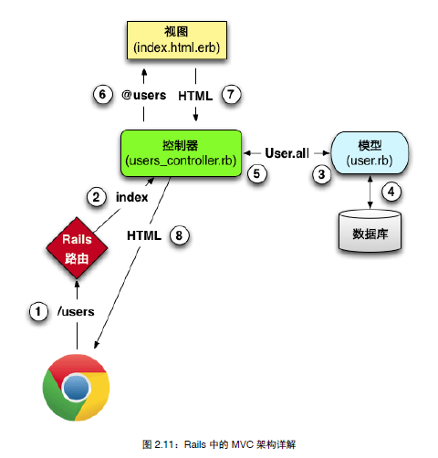

# Ruby on Rails Tutorial - Note 3

### 第 7 章 注册

#### 7.1 显示用户的信息

##### 7.1.1 调试信息和 rails 环境

在网页底部加上

    

      <%= yield %>
      <%= render 'layouts/footer' %>
      <%= debug(params) if Rails.env.development? %>
    

rails 三大环境：测试环境，开发环境，生产环境，详见旁注 7.1。

##### 7.1.2 用户资源

在 routes.rb 中增加一句：

    resources :users

自动生成以下路由：

在 app/views/users 目录下新建 show.html.erb，写入

    <%= @user.name %>, <%= @user.email %>

而 @user 的值来自 Users 控制器，在 app/controllers/users_controller.rb 中，写入

    def show
      @user = User.find(params[:id])
    end

##### 7.1.3 调试器

byebug gem。

相当于断点调试器。在想断点的地方加上 debugger。访问网页的时候控制台就会在这个地方断下来，nb~!

##### 7.1.4 Gravatar 头像和侧边栏

用 aside 标签定义侧边栏。aside 中的内容一般是对主体内容的补充 (如侧边栏)。把 class 设为 `row col-md-4` (都是 bootstrap 提供的)。

#### 7.2 注册表单

先把后台创建的用户删掉

    $ bundle exec rake db:migrate:reset

创建表单，使用 `form_for` 方法。

心得：

- Rails 的 MVC，控制器 C 作为中枢，负责和 M，V 联系。M 和 V 之间没有任何联系，是相互隔离的。这和客户端的 MVC 有所不一样，客户端的 MVC，M 和 V 是可以相互通信的。
- 一个控制器中的一个动作，默认有一个同名的 view。
- 模型是独立的，控制器中的任何一个动作，都可以操作任意一个模型。

再次回顾这个图。

在这里，注册的路由 /signup 对应的是 Users 控制器下的 new 动作。

    // app/config/routes.rb
    get 'signup' => 'Users#new'

所以，我们首先要在 Users#new 动作里，创建一个 User 模型的对象，然后传到 app/views/users/new.html.erb views 中渲染。

    // app/controllers/users_controller.rb
    def new
      @user = User.new
    end

    // app/views/users/new.html.erb
    <% provide(:title,'SignUp') %>

    <h1>Sign Up</h1>

      

      

        <%= form_for(@user) do |f| %>
          <%= f.label :name %>
          <%= f.text_field :name %>
          <%= f.label :email %>
          <%= f.text_field :email %>
          <%= f.label :password %>
          <%= f.password_field :password %>
          <%= f.label :password_confirmation, "Confirmation" %>
          <%= f.password_field :password_confirmation %>
          <%= f.submit "Create my account", class: "btn btn-primary" %>
        <% end %>
      

    

生成的 html 代码：

    

      

        <form class="new_user" id="new_user" action="/users" accept-charset="UTF-8" method="post"><input name="utf8"
        type="hidden" value="&#x2713;" /><input type="hidden" name="authenticity_token" value="6P6s7x1cQTRls65gB+98wKQnD5M
        +Kqv4/WnIR1FEVo906eUP43qqMjCXRIbPwyqOe5e893FwIE+RZjPvqZbnjw==" />
          <label for="user_name">Name</label>
          <input type="text" name="user[name]" id="user_name" />
          <label for="user_email">Email</label>
          <input type="text" name="user[email]" id="user_email" />
          <label for="user_password">Password</label>
          <input type="password" name="user[password]" id="user_password" />
          <label for="user_password_confirmation">Confirmation</label>
          <input type="password" name="user[password_confirmation]" id="user_password_confirmation" />
          <input type="submit" name="commit" value="Create my account" class="btn btn-primary" />
        </form>
      

    

修改样式，略。

##### 7.2.2 注册表单的 html

分析 `form_for` 辅助方法。

    <form action="/users" class="new_user" id="new_user" method="post">

#### 7.3 注册失败

    def create
      @user = User.new(params[:user])
      if @user.save
        puts 'save ok' # in fact shold be redirect to another url
      else
        render 'new'
      end
    end

在注册页面随便填了一些内容后，点击"Create my account"，页面出错。从 log 来看，出错的原因是批量赋值导致的。

##### 7.3.2 健壮参数

在 Rails 4.0 以后，使用健壮参数解决上面的问题。

    params.require(:user).permit(:name, :email, :password, :password_confirmation)

##### 7.3.3 注册失败错误消息

    >> user.errors.full_messages
    => ["Email is invalid", "Password is too short (minimum is 6 characters)"]

    <%= form_for(@user) do |f| %>
      <%= render 'shared/error_messages' %>
      <%= f.label :name %>
      <%= f.text_field :name, class:'form-control' %>

##### 7.3.4 注册失败的测试 (自动化测试的重要性!)

生成一个集成测试文件

    $ rails generate integration_test users_signup

    class UsersSignupTest < ActionDispatch::IntegrationTest
      test 'invalid signup information' do
        get signup_path
        assert_no_difference 'User.count' do
          post users_path, user: { name: "",
                                  email: "user@invalid",
                                  password: "foo",
                                  password_confirmation: "bar" }
        end
        assert_template 'users/new'
      end
    end

#### 7.4 注册成功

保存成功后重定向到显示用户资料界面。

##### 7.4.1 完整的注册表单

    def create
      @user = User.new(new_params)
      if @user.save
        puts @user.id
        redirect_to @user 
        # 是因为当前类是 UsersController，所以 redirect_to 知道是重定向到 /users/id ??
        # 哦，原来这是 redirect_to user_url(@user) 的简写
      else
        render 'new'
      end
    end

##### 7.4.2 闪现消息

    flash[:success] = "Welcome to the Sample App!"

    // application.html.erb
    <body>
      <%= render 'layouts/header' %>
      

        <% flash.each do |message_type, message| %>
          
"><%= message %>

        <% end %>
        <%= yield %>
        <%= render 'layouts/footer' %>
        <%= debug(params) if Rails.env.development? %>
      

    </body>

bootstrap 提供的 css 样式支持四种闪现消息样式，success, info, warning, danger。

##### 7.4.3 首次注册

效果：首次注册成功后，显示 flash message，刷新后不显示。

##### 7.4.4 注册成功的测试

    test 'valid signup information' do
      get signup_path
      name = "example"
      email = "user@example.com"
      password = "1234567"
      assert_difference 'User.count', 1 do
      post_via_redirect users_path, user: { name: name,
                                            email: email,
                                            password: password,
                                            password_confirmation: password }
      end
      assert_template 'users/show'
    end

问题，测试成功后，为什么这个用户的信息没有存入数据库呢 (通过 rails console 查看了确实没有) 它是怎么做到的啊? 因为测试时用的是测试数据库，不是开发数据库。

#### 7.5 专业布署方案

##### 7.5.1 在生产环境中使用 SSL (Secure Socket Layer)

    config/environments/production.rb
    # Force all access to the app over SSL, use Strict-Transport-Security, and use secure cookies.
    config.force_ssl = true

##### 7.5.2 在生产环境中使用 Unicorn

Heroku 默认使用纯 ruby 实现的 WEBrick，它易于搭建，但不能很好地处理蔬大流量，因此在生产环境中，要使用能处理大量请求的 Unicorn。

    // Gemfile
    group :production do
      gem 'pg', '0.17.1'
      gem 'rails_12factor', '0.0.2'
      gem 'unicorn', '4.8.3'
    end

剩余略，粗略看看。需要时再回头看。

#### 7.7 练习

略。

### 第 8 章 登录和退出

网络中三种常见的方式实现登录退出：

1. 浏览器关闭后**忘记**用户的登录状态
1. 自动记住用户的登录状态
1. 勾选**记住我**时才记住用户的登录状态

#### 8.1 会话

HTTP 协议 没有状态，每个请求都是独立的。

需要用户登录的应用都要使用**会话** (session)。最常见的方法是使用 cookie。

##### 8.1.1 会话控制器

登录和退出功能由会话控制器中的相应动作处理。登录表单在 new 动作中处理，登录的过程是向 create 动作发送 post 请求，退出则是向 destroy 动作发送 delete 请求。

生成会话控制器 和 new 动作 (同时会生成 new 视图)。

    $ rails generate controller Session new

修改路由。用户资源使用特殊的 resources 方法自动获得得符合 REST 架构的路由，会话资源只能使用具名路由。

    get    'login'  => 'sessions#new'
    post   'login'  => 'sessions#create'
    delete 'logout' => 'sessions#destroy'

查看所有路由

    $ bundle exec rake routes

##### 8.1.2 登录表单

与注册页面类似，但由于会话不是模型，因此不能创建 @user 的变量。因此不能直接用 `form_for(@user)`，必须指定更详细的参数。如：`form_for(:session, url: login_path)`。

    <%= form_for(:session, url:login_path) do |f| %>
      <%= f.label :email %>
      <%= f.text_field :email%>
      <%= f.label :password %>
      <%= f.password_field :password%>
      <%= f.submit "Log in", class: "btn btn-primary" %>
    <% end %>

##### 8.1.3 查找并认证用户

##### 8.1.4 显示 flash 消息

    def create
      user = User.find_by(email: params[:session][:email].downcase)
      if user && user.authenticate(params[:session][:password])
        # login ok
      else
        # login failed
        # print error message
        flash[:danger]="Invalid email/password combination" # 有点小问题
        render 'new'
      end
    end

render 和**重定向**不一样，不算一次新的请求。因此上面的处理会导致 flash 停留的时间过长。

##### 8.1.5 测试闪现消息

    $ rails generate integration_test users_login

    class UsersLoginTest < ActionDispatch::IntegrationTest
      test "login with invalid information" do
        get login_path
        assert_template 'sessions/new'
        post login_path, session:{email:"", password:""}
        assert_template 'sessions/new'
        assert_not flash.empty?
        get root_path
        assert flash.empty?
      end
    end

    $ bundle exec rake test TEST=test/integration/users_login_test.rb # 单独测试某个文件的方法

测试不通过。

解决办法，把

    flash[:danger]="Invalid email/password combination" # 有点小问题

改成

    flash.now[:danger]="Invalid email/password combination"

#### 8.2 登录

本节通过临时会话让用户登录，浏览器关闭后会话自动失效。

在控制器的基类 ApplicationController 中引入辅助方法模块。

    class ApplicationController < ActionController::Base
      protect_from_forgery with: :exception
      include SessionsHelper
    end

##### 8.2.1 `log_in` 方法

    module SessionsHelper
      def log_in(user)
        session[:user_id] = user.id
      end
    end

这里 `session[:user_id]` 会自动加密 (怎么做到? Rails 自带?)。

在控制器里调用 `log_in` 方法

    if user && user.authenticate(params[:session][:password])
      # login ok
      log_in user
      redirect_to user

##### 8.2.2 当前用户

在 SessionsHelper 中定义

    def current_user
      @current_user ||= User.find_by(id: session[:user_id])
    end

##### 8.2.3 修改布局中的链接

登录成功以后，改变 header 部分的布局。

使用了 bootstrap 的下拉菜单，需要在 application.js 中引入 bootstrap 的 js 库。

    app/assets/javascripts/application.js
    //= require bootstrap

修改 `_header.html.erb`：

    <% if logged_in? %>
      <li><%= link_to "Users", "#"%></li>
      <li class="dropdown">
      <a href="#" class="dropdown-toggle" data-toggle="dropdown">
      Accout <b class="caret"></b>
      </a>
      <ul class="dropdown-menu">
        <li><%= link_to "Profile", current_user %></li>
        <li><%= link_to "Settings", "#" %></li>
        <li class="divider"></li>
        <li><%= link_to "Log out", logout_path, method: "delete" %></li>
      </ul>
      </li>
    <% else %>
      <li><%= link_to "Log in", login_path %></li>
    <% end %>

##### 8.2.4 测度布局中的变化

定义类方法：

    // app/models/user.rb
    class User < ActiveRecord::Base
      ...
      def User.digest(password)
        cost = ActiveModel::SecurePassword.min_cost ? BCrypt::Engine::MIN_COST : BCrypt::Engine.cost
        BCrypt::Password.create(password, cost: cost)
      end
    end

定义 fixtures：

    // app/test/fixtures/users.yml
    michael:
      name: Michael
      email: michael@example.com
      password_digest: <%= User.digest("1234567") %>

在测试中使用 fixtures：

    class UsersLoginTest < ActionDispatch::IntegrationTest
      def setup
        @user = users(:michael)
      end

      ...
      test "login with valid information" do
        get login_path
        assert_template 'sessions/new'
        post login_path, session:{email:@user.email, password:"1234567"}
        assert_redirected_to @user
        follow_redirect!
        assert_template 'users/show'
        assert_select 'a[href=?]', login_path, count: 0
        assert_select 'a[href=?]', logout_path
        assert_select 'a[href=?]', user_path(@user)
      end
    end

`assert_redirect_to @user` 用于检查重定向是否正确。`follow_redirect!` 用于访问重定向后的地址。

指定测试某个测试文件中的某个测试，使用选项 TEST 和 TESTOPTS。

    $ bundle exec rake test TEST=test/integration/users_login_test.rb \
    > TESTOPTS="--name test_login_with_valid_information"

##### 8.2.5 注册后直接登录

注册成功后调用 `log_in` 方法，保存 user.id 到 session 中。同时更新测试文件。

#### 8.3 退出

在 SessionContrller 的 destroy 动作中，将 `user_id` 从 session 中删除，然后重定向到 `root_path`

### 8.4 记住我

使用 cookie

为 User 模型加上 `remember_digest` 列。

    $ rails generate migration add_remember_digest_to_users remember_digest:string

    class AddRememberDigestToUsers < ActiveRecord::Migration
      def change
        add_column :users, :remember_digest, :string
      end
    end

    $ bundle exec rake db:migrate

用什么做记忆令牌。ruby 的 SecureRandom 模块的 `urlsafe_base64` 方法。这个方法返回长度为 22 的随机字符串。

    $ rails console
    > SecureRandom.urlsafe_base64
    => "EeI8UNf0MC2w4LlF9U79Qw"

在 User 类中定义此方法

    # 返回一个随机令牌
    def User.new_token
      SecureRandom.urlsafe_base64
    end

在数据库中记住用户。使用虚拟属性，使用 attr_accessor 关键字。

    class User < ActiveRecord::Base
      attr_accessor :remember_token
      ...
      # 为了持久会话，在数据库中记住用户
      def remember
        self.remember_token = User.new_token
        update_attribute(:remember_digest, User.digest(remember_token))
      end
    end

##### 8.4.2 登录时记住登录状态

使用 cookies 方法，类似 session，也是一个哈希表。

    // permanent 是辅助方法
    cookies.permanent[:remember_token] = remember_token
    // 不能存 user.id 的明文，signed 是可逆的， signed 后再次 signed 得到原值
    cookies.permanent.signed[:user_id] = user.id

从 cookie 取出 user_id，查找用户

    User.find_by(id: cookies.signed[:user_id])

对比 `remember_token` 和 `remember_digest`

    // app/models/user.rb
    # 验证 token 和 digest
    def authenticated(remember_token)
      BCrypt.Password.new(remember_digest).is_password?(remember_token)
    end

在 SessionHelper 中定义 remember 方法

    def remember(user)
      user.remember
      cookies.permanet.signed[:user_id]=user.id
      cookies.permanet[:remember_token]=user.remember_token
    end

?? 不理解啊，rails 代码不是跑在服务器上的吗，而存储 cookies 的行为应该是浏览器才能做的呀，应该调用 js 完成才对吧。
(现在明白了，在 rails 代码中定义好了 cookie 的内容后，这些内容会出现在 http response 的 header 中，浏览器会负责把 header 中的 cookie 存储到本地，并且在每次发起 Http request 时带上把本地的 cookie 带在 header。)

在 SessionController 中登录成功后，调用 remember 方法

    def create
      user = User.find_by(email: params[:session][:email].downcase)
      if user && user.authenticate(params[:session][:password])
        # login ok
        log_in user
        remember user
        redirect_to user

这时，我终于明白所谓的前面加了 @ 后就成了什么实例变量，比如 @user。这种变量其实就是类的成员变量啦，在类的各个函数中可以调用。如果不加 @，那就是局部变量了，只可以在函数内部使用。

重新定义 SessionHelper 中的 `current_user` 方法

    def current_user
      if (user_id = session[:user_id])
        @current_user ||= User.find_by(id: user_id)
      elsif (user_id = cookies.signed[:user_id])
        user = User.find_by(user_id)
        if user && user.authenticated(cookies[:remember_token])
          log_in user
          @current_user = user
        end
      end
    end

##### 8.4.3 忘记用户

在 User 模型中定义 forget 方法，更新 `remember_digest` 为 nil

    # 忘记用户
    def forget
      update_attribute(:remember_digest, nil)
    end

在 SessionHelper 中定义 forget 方法，清除 cookies。退出时调用 forget 方法。

    # 忘记持久会话
    def forget(user)
      user.forget
      cookies.delete(:user_id)
      cookies.delete(:remember_token)
    end

    # 退出时忘记用户
    def log_out
      forget(current_user)
      session.delete(:user_id)
      @current_user = nil
    end

##### 8.4.4 两个小问题

解决在多个窗口或多个浏览器中同时访问，一个退出后，另一个再退出时会出现错误的问题。

通过这一小节，解决我一个疑惑。我平时在家登录水木，明明是勾选了记住，可以有时回来后一登，还是要我输用户名和密码。现在知道原因了，因为我后来又在公司登录了，这样就改变了服务器上的信息，再回到家登录，cookies 中的内容就无效了。

所以这种用 cookies 来实现记住我的效果，只能限定在一台机器上的同一个浏览器使用，只要在另一台机器或另一个浏览器中登录过，该 cookie 就会失效。

##### 8.4.5 记住我 复选框

加一个 checkbox。然后在登录后，根据这个值，如果为 1 就 remember，否则 forget。

##### 8.4.6 测试记住我功能

    defined?
    assert_not_nil
    assert_nil

测试"记住"分支。"我最喜欢在未测试中的代码块中抛出异常"。抛出异常用 raise。

#### 8.6 练习

- assigns 方法。
- 定义静态方法的另两种方法。
